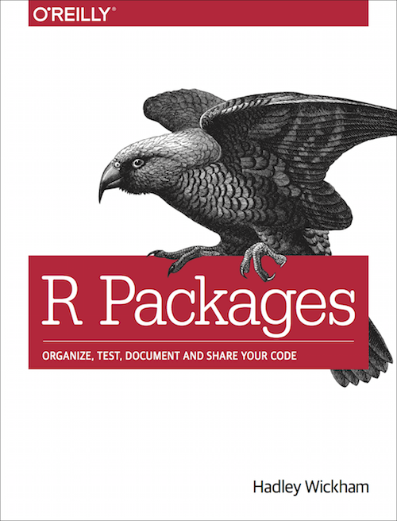

= R Packages (2e)
Hadley Wickham 和 Jennifer Bryan
:description: 学习如何创建软件包（package），它是可分享、可复用和可重复的 R 代码。
:toc:
:doctype: book

== 欢迎！

  欢迎来到由 http://hadley.nz[Hadley Wickham] 和 http://jennybryan.org/[Jennifer Bryan] 等撰写的 _R Package_。 软件包（`+Packages+`）是可复用 R 代码的基本单位。 它们包含可复用的 R 函数、描述如何使用这些函数的文档以及示例数据。在本书中，你将学习如何将你的代码变成别人能够轻松下载和使用的软件包。刚开始编写软件包可能会让人感觉无从下手。因此我们从基础的内容开始，逐渐提升我们的开发水平。你的第一个版本是否完美并不重要，只要下一版本变得更完善就好。

  这是本书的第二版，仍在开发编撰中。

:leveloffset: +1

include::translator-preface.adoc[]

include::preface.adoc[]

:leveloffset: -1
