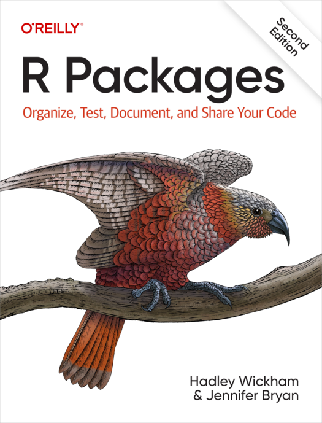

= R Packages (2e)
Hadley Wickham 和 Jennifer Bryan
:description: 学习如何创建软件包（package），它是可分享、可复用和可重复的 R 代码。
:toc:
:doctype: book

== 欢迎！

欢迎来到由 http://hadley.nz[Hadley Wickham] 和 http://jennybryan.org/[Jennifer Bryan] 等撰写的第二版 _R Package_ 的在线版本。 软件包（`+Packages+`）是可复用 R 代码的基本单位。 它们包含可复用的 R 函数、描述如何使用这些函数的文档以及示例数据。 在本书中，你将学习如何将你的代码变成别人能够轻松下载和使用的软件包。 刚开始编写软件包可能会让人感觉无从下手。 因此我们从基础的内容开始，逐渐提升我们的开发水平。 你的第一个版本是否完美并不重要，只要下一版本变得更完善就好。

本网站在 https://creativecommons.org/licenses/by-nc-nd/4.0/[CC BY-NC-ND 4.0] 许可下是并将永远是免费的。 如果你想要一本实体书，你可以在 https://www.amazon.com//dp/109813494X?tag=hadlwick-20[Amazon] 上订购。

:leveloffset: +1

include::translator-preface.adoc[]

include::preface.adoc[]

include::introduction.adoc[]

:leveloffset: -1

= 入门
:leveloffset: +1

include::whole-game.adoc[]

include::setup.adoc[]

include::structure.adoc[]

include::workflow101.adoc[]

include::package-within.adoc[]

include::references.adoc[]

[appendix]
include::R-CMD-check.adoc[]

:leveloffset: -1
