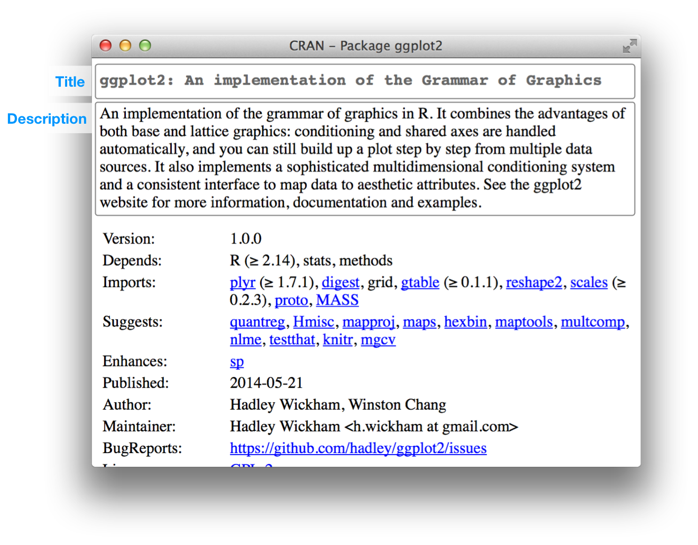

第七章 程序包元数据
============================

``DESCRIPTION`` 文件的功能是储存关于您的程序包的重要元数据。当您第一次开始编写程序包时，您将主要使用这些元数据来记录运行您的程序包所需的其他程序包。\
然而，随着时间的推移，您开始与其他人共享您的包，元数据文件变得越来越重要，因为它指定了谁可以使用它（许可证）以及如果有什么问题时与谁联系（您！）。

每个程序包都必须有 ``DESCRIPTION`` 文件。事实上，它是定义一个程序包的关键特征（RStudio 和 devtools 将包含 ``DESCRIPTION`` 的任何目录都视为程序包）。\
首先，``usethis::create_package("mypackage")`` 会自动添加一个基本的描述文件。这将允许您开始编写程序包而不必担心元数据，直到您需要为止。\
最基础的描述会根据您的设置有所不同，但应该看起来像下面这样：

.. code-block:: yaml

    Package: mypackage
    Title: What The Package Does (one line, title case required)
    Version: 0.1
    Authors@R: person("First", "Last", email = "first.last@example.com",
                    role = c("aut", "cre"))
    Description: What the package does (one paragraph)
    Depends: R (>= 3.1.0)
    License: What license is it under?
    LazyData: true

（如果您编写了很多程序包，可以通过 ``devtools.desc.author``, ``devtools.desc.license``, ``devtools.desc.suggests`` \
和 ``devtools.desc`` 设置全局选项。使用 ``package?devtools`` 了解更多详细信息。）

``DESCRIPTION`` 使用了一个名为 DCF 的简单文件格式，即 Debian 控件格式（Debian Control Format）。您可以在下面的简单示例中看到大部分结构。\
每行由一个\ **字段**\ 名和一个值组成，用冒号分隔。当值跨越多行时，需要行首缩进：

.. code-block:: yaml

    Description: The description of a package is usually long,
        spanning multiple lines. The second and subsequent lines
        should be indented, usually with four spaces.

本章将向您展示怎样使用最重要的一些 ``DESCRIPTION`` 字段。


7.1 依赖项：您的程序包需要什么？
---------------------------------------

``DESCRIPTION`` 的作用是列出您的程序包工作时需要的其他程序包。R 有一套丰富的方法来描述潜在的依赖关系。例如，以下几行表示您的包需要 ggvis 和 dplyr 才能工作：

.. code-block:: yaml

    Imports:
        dplyr,
        ggvis


然而，下面的几行表示，虽然您的程序包可以利用 ggvis 和 dplyr，但并不需要它们：

.. code-block:: yaml

    Suggests:
        dplyr,
        ggvis

``Imports`` 和 ``Suggests`` 都采用逗号分隔的程序包名称列表。我建议每行放一个程序包，并按字母顺序排列。这样就很容易浏览。

``Imports`` 和 ``Suggests`` 在依赖程度上有所不同：

- ``Imports`` ：这里列出的程序包 \ *必须*\  存在，您的程序包才能正常工作。实际上，无论何时安装程序包，它们（如果尚未存在）都将安装在您的计算机上（``devtools::load_all()`` 还会检查程序包是否已安装）。

    在此处添加程序包依赖项可确保程序包能够正确安装。但是，这并不意味着它将与您的程序包一起添加到环境中（即 ``library(x)``）。最佳方法是在代码中使用语法 ``package::function()`` 显式引用外部函数。这使得我们很容易确定哪些函数位于程序包之外。并且在以后阅读代码时特别有用。

    如果您需要使用其他程序包中的许多函数，这将相当冗长。还有一个与 ``::`` 相关的轻微性能损失（大约为 5µs，因此只有当您调用函数数百万次时才会有影响）。您将在 \ `namespace imports <https://r-pkgs.org/namespace.html#imports>`__\  中了解调用其他程序包中函数的其他方法。

- ``Suggests`` ：您的程序包可以使用这些程序包，但并不需要它们。您可以使用建议的程序包（例如数据集）来运行测试、构建 vignette，或者可能只有一个函数需要该包。

    ``Suggests`` 中列出的程序包不会与程序包一起自动安装。这意味着您需要在使用包之前检查它是否可用（使用 ``requireNamespace(x, quietly = TRUE)``）。有两种基本情况：

    .. code-block:: R

        # You need the suggested package for this function    
        my_fun <- function(a, b) {
            if (!requireNamespace("pkg", quietly = TRUE)) {
                stop("Package \"pkg\" needed for this function to work. Please install it.",
                call. = FALSE)
            }
        }

        # There's a fallback method if the package isn't available
        my_fun <- function(a, b) {
            if (requireNamespace("pkg", quietly = TRUE)) {
                pkg::f()
            } else {
                g()
            }
        }

在本地开发程序包时，永远不需要使用 ``Suggests``。发布程序包时，使用 ``Suggests`` 是对用户的礼貌。它使用户避免下载很少需要的程序包，并让他们尽快开始使用您的程序包。

将 ``Imports`` 和 ``Suggests`` 添加到程序包中的最简单方法是使用 ``usethis::use_package()``。这会自动将它们放在 ``DESCRIPTION`` 中的正确位置，并提醒您如何使用它们。

.. code-block:: R

    usethis::use_package("dplyr") # Defaults to imports
    #> Adding dplyr to Imports
    #> Refer to functions with dplyr::fun()
    usethis::use_package("dplyr", "Suggests")
    #> Adding dplyr to Suggests
    #> Use requireNamespace("dplyr", quietly = TRUE) to test if package is 
    #>  installed, then use dplyr::fun() to refer to functions.


7.1.1 版本控制
..................

如果需要程序包的特定版本，请在其名称后的括号中指定：

.. code-block:: yaml

    Imports:
        ggvis (>= 0.2),
        dplyr (>= 0.3.0.1)
    Suggests:
        MASS (>= 7.3.0)

您应该总是希望指定最小的版本，而不是精确的版本（``MASS (== 7.3.0)``）。因为 R 不能同时加载同一个包的多个版本，所以指定一个确切的依赖关系会大大增加版本冲突的可能性。

当您发布包时，版本控制是最重要的。通常情况下，人们安装的程序包版本与您不完全相同。如果有人有一个旧的包，它没有您的包需要的功能，那么他们会得到一个无用的错误消息。\
但是，如果您提供版本号，他们会收到一条错误消息，告诉他们问题的确切原因：一个低版本的程序包。

如果您声明了一个最低版本，请仔细考虑。在某种意义上，最安全的做法是要求版本大于或等于程序包的当前版本。对于合作工作，最自然的就是定义为程序包的当前 CRAN 版本；\
私人或个人项目可以采用其他一些惯例。但是重要的是要意识到对哪些尝试安装您的程序包的人的影响：如果他们的本地安装不能满足您对版本的所有要求，那么安装要么失败要么强制升级这些依赖项。\
如果您的最低版本要求是真实需要的，那么这是可取的，即如果不这样做，您的程序包将被破坏。但是，如果您所说的版本需求并没有扎实的理由，那么这可能是不必要的保守并造成不方便。

在没有明确的硬性要求的情况下，您应该根据您预期的用户基础、他们可能拥有的程序包版本以及过于宽松与过于保守的成本效益分析来设置最低版本（或不设置）。

TODO: return here and insert concrete details closer to publication. \
Thing 1: mention relevant usethis function(s). \
Today that is ``use_tidy_version()``n but it needs some work (https://github.com/r-lib/usethis/issues/771). \
Thing 2: See if Kirill’s prototype of studying minimum version has matured into anything we can recommend for general use (https://github.com/r-lib/pillar/tree/c017f20476fce431ceee18cc3a637f7ed2884d3a/minver#readme)


7.1.2 其他依赖项
..................

另外还有三个字段允许您表达更专业的依赖关系：

- ``Depends``：在 R 2.14.0 推出命名空间（namespaces）之前，``Depends`` 是“依赖”另一个包的唯一方法。现在，不管名字是什么，您应该总是使用 ``Imports``，而不是依赖 ``Depends``。您将了解在 \ `namespaces <https://r-pkgs.org/namespace.html#namespace>`__\  中为什么以及何时仍应使用 ``Depends``。

    您还可以使用 ``Depends`` 来要求使用 R 的特定版本，例如 ``Depends: R (>=3.4.0)``。同样，如果您这样做，请仔细考虑。这与为依赖的程序包设置最低版本是一样的问题，只是涉及到 R 本身的风险要高得多。用户不能简单地同意必要的升级，因此，如果其他程序包依赖于您的程序包，您对 R 的最低版本要求可能会导致一系列程序包安装的失败。

    * 如果您想使用 ``trimws()`` 之类的函数， \ `backports 程序包 <https://cran.r-project.org/package=backports>`__\  非常有用，它是在 3.3.0 版本中引入的，同时仍然支持较旧的 R 版本。
    * tidyverse 正式支持当前的 R 版本、devel 版本和四个以前的版本。我们在用于持续集成的标准构建矩阵中主动测试了这种支持。
    * 使用级别较低的程序包可能不需要这种严格级别。主要的收获是：如果您规定了一个最低限度的版本，您应该有令人信服的理由，并且应该采取合理的措施，以定期测试您的要求。

- ``LinkingTo``：这里列出的程序包依赖于另一个包中的 C 或 C++ 代码。您将在 \ `compiled code <https://r-pkgs.org/src.html#src>`__\  中了解有关 ``LinkingTo`` 的更多信息。
- ``Enhances``：这里列出的程序包由您的程序包“增强”。通常，这意味着您为在另一个包中定义的类提供方法（与 ``Suggests`` 相反）。但是很难定义这意味着什么，所以我不建议使用 ``Enhances``。

您需要的在 R 之外的东西也可以在 ``SystemRequirements`` 字段中列出。但这只是一个纯文本字段，不会自动检查。可以把它当作一个快速参考；您还需要在 README 中写入详细的系统需求（以及如何安装它们）。


7.2 标题和描述：您的程序包能够做什么？
----------------------------------------------------

title 和 description 字段描述程序包的功能。它们只是在长度上有所不同：

- ``Title`` 是程序包的一行描述，通常显示在程序包列表中。它应该是纯文本（无标记），像标题一样大写，\ **不能**\ 以句点结尾。让它保持简短：程序包列表通常会将标题截断为 65 个字符。
- ``DESCRIPTION`` 比 title 更详细。可以用多个句子，但是只能用一个段落。如果你的描述跨越多行（而且它应该有多行！），每行宽度不得超过 80 个字符。用 4 个空格缩进后继续一行。

ggplot2 的 ``Title``` 和 ``DESCRIPTION`` 为：

.. code-block:: yaml

    Title: An implementation of the Grammar of Graphics
    Description: An implementation of the grammar of graphics in R. It combines 
        the advantages of both base and lattice graphics: conditioning and shared 
        axes are handled automatically, and you can still build up a plot step 
        by step from multiple data sources. It also implements a sophisticated 
        multidimensional conditioning system and a consistent interface to map
        data to aesthetic attributes. See the ggplot2 website for more information, 
        documentation and examples.

一个好的标题和描述是很重要的，特别是如果计划将程序包发布到 CRAN，因为它们出现在 CRAN下载页面上，如下所示：

|cran-package|

因为 ``Description`` 只给了您一小部分空间来描述程序包的功能，所以我还建议包含一个 ``README.md`` 文件，它深入到更深入程序包的地方，并展示一些示例。\
您将在 \ `README.md <https://r-pkgs.org/release.html#readme>`__\ 中了解到这些。


7.3 作者：您是谁？
--------------------------

要确定程序包的作者，以及出错时与谁联系，请使用 ``Authors@R`` 字段。这个字段并不普通，因为它包含可执行的 R 代码而不是纯文本。下面是一个例子：

.. code-block:: yaml

    Authors@R: person("Hadley", "Wickham", email = "hadley@rstudio.com",
        role = c("aut", "cre"))

.. code-block:: R

    person("Hadley", "Wickham", email = "hadley@rstudio.com", 
    role = c("aut", "cre"))
    #> [1] "Hadley Wickham <hadley@rstudio.com> [aut, cre]"


这个命令表示作者（aut）和维护者（cre）都是 Hadley Wickham，他的电子邮件地址是 ``hadley@rstudio.com``。``person()`` 函数有四个主要参数：

- 由前两个参数，``given`` 和 ``family``（它们通常由位置而不是名称提供）指定的名称。在英国文化中，名在姓之前。在许多文化中，这种习俗并不成立。
- 电子邮件地址 ``email``。
- 指定角色 ``role`` 的三个字母组成的代码。有四个重要角色：

    + cre：创建者或维护者，如果您有麻烦，您应该向其请求帮助。
    + aut：作者，那些对这个程序包做出重大贡献的人。
    + ctb：贡献者，那些贡献较小的人，比如贡献了补丁。
    + cph：版权所有人。如果版权由作者以外的人（通常是公司，即作者的雇主）持有，则使用此选项。

（\ `完整的角色列表 <https://www.loc.gov/marc/relators/relaterm.html>`__\ 非常全面。\
如果您的软件包中有一个 woodcutter ("wdc")、liricist ("lyr") 或 custome designer ("cst")，请放心，您可以正确描述他们在创建程序包中的作用（角色）。）

如果需要添加进一步的说明，也可以使用 ``comment`` 参数并以纯文本形式提供所需的信息。

可以使用 ``c()`` 列出多个作者：

.. code-block:: yaml

    Authors@R: c(
        person("Hadley", "Wickham", email = "hadley@rstudio.com", role = "cre"),
        person("Winston", "Chang", email = "winston@rstudio.com", role = "aut"))

每个程序包必须至少有一个作者（aut）和一个维护者（cre）（他们可能是同一个人）。维护者必须有一个电子邮件地址。这些字段用于生成程序包的基本引文（例如 ``citation("pkgname")``）。\
只有被列为作者的人才会包含在自动生成的引文中。如果包含其他人编写的代码，还有一些额外的细节。因为这通常发生在封装 C 库时，所以在 \ `compiled code <https://r-pkgs.org/src.html#src>`__\  中讨论过。

除了您的电子邮件地址外，列出其他有帮助的资源也是一个好主意。您可以在 ``URL`` 中列出 URLs。多个 URLs 用逗号分隔。``BugReports`` 是提交 BUG 报告的 URL。例如，knitr 有：

.. code-block:: yaml

    URL: https://yihui.name/knitr/
    BugReports: https://github.com/yihui/knitr/issues

您还可以使用单独的 ``Maintainer`` 和 ``Author`` 字段。我不喜欢使用这些字段，因为 ``Authors@R`` 能够提供更丰富的元数据。


7.3.1 在 CRAN 上
......................

最重要的是，您的电子邮件地址（即 ``cre`` 的地址）是 CRAN 将用来提供关于您的程序包相关信息的电子邮箱地址。所以确保使用的电子邮件地址将会存在一段时间。\
此外，由于该地址将用于自动邮寄，因此 CRAN 政策要求该地址只能用于一个人（而不是邮件列表），并且不需要任何确认或使用任何筛选。


7.4 许可证：谁可以使用您的程序包？
----------------------------------------------------

``License`` 字段可以是开源许可证（如 ``GPL-2`` 或 ``BSD``）的标准缩写，也可以是指向包含更多信息的文件（``file LICENSE``）的指针。\
只有当您计划发布您的程序包时，许可证才是真正重要的。如果没有这个打算，则可以忽略此部分。如果您想明确程序包是不开源的，使用 ``License: file LICENSE`` 创建一个叫做 ``LICENSE`` 的文件，可以包含以下内容：

.. code-block:: text

    Proprietary 

    Do not distribute outside of Widgets Incorporated.

开源软件许可是一个丰富而复杂的领域。幸运的是，在我看来，对于您的 R 包，只有三个许可证需要考虑：

- \ `MIT <https://tldrlegal.com/license/mit-license>`__\  （类似 BSD 2-Clause 和 BSD 3-Clause 许可证）。这是一个简单的许可证。它允许人们使用和自由分发您的代码，但只有一个限制：许可证必须始终与代码一起分发。
    
    MIT许可证是一个“模板”，因此如果您使用它，您需要 ``License: MIT + file LICENSE``，以及如下所示的许可证文件：

    .. code-block:: yaml

        YEAR: <Year or years when changes have been made>
        COPYRIGHT HOLDER: <Name of the copyright holder>

- \ `GPL-2 <https://tldrlegal.com/license/gnu-general-public-license-v2>`__\  或 \ `GPL-3 <https://tldrlegal.com/license/gnu-general-public-license-v3-(gpl-3)>`__\ 。这些是“复制遗留”许可证。这意味着，以捆绑包形式分发您的代码的任何人都必须以 GPL 兼容方式作为捆绑包的许可。此外，任何分发代码修改版本（衍生作品）的人也必须开源他们的源代码。GPL-3 比 GPL-2 严格一点，弥补了一些老漏洞。
- \ `CC0 <https://tldrlegal.com/license/creative-commons-cc0-1.0-universal>`__\ 。它放弃您对代码和数据的所有权利，以便任何人都可以出于任何目的自由使用它。这有时被称为公共领域，这一术语在所有国家既没有明确定义也没有意义。

    此许可证最适合于数据包。至少在美国，数据是不受版权保护的，所以您不会放弃太多。这张许可证正好说明了这一点。


如果您想了解更多有关其他常用许可证的信息，查阅 Github 的 \ `choosealicense.com <https://choosealicense.com/licenses/>`__\  是个好的开始。\
另一个好的资源是 https://tldrlegal.com/，它解释了每个许可证的最重要部分。如果您使用的许可证不是我建议的三种许可证，请务必参考 "Writing R Extensions" 关于 \ `licensing <https://cran.r-project.org/doc/manuals/R-exts.html#The-DESCRIPTION-file>`__\  的部分。

如果您的软件包中包含不是您编写的代码，则需要确保您的使用符合它的许可证。由于这通常发生在包含 C 源代码时，在 \ `compiled code <https://r-pkgs.org/src.html#src>`__\  中会更详细地讨论它。


7.4.1 在 CRAN 上
......................

如果您想把您的程序包提交到 CRAN，您必须选择一个标准许可证。否则，CRAN 很难确定分发您的程序包是否合法！您可以找到 CRAN 认为有效的许可证的完整列表 https://svn.r-project.org/r/trunk/share/licenses/license.db。


7.5 版本
---------------

从形式上讲，R 程序包版本是由至少两个被 ``.`` 或 ``-`` 分隔的整数组成的序列。例如，``1.0`` 和 ``0.9.1-10`` 是有效的版本号，但 ``1`` 或 ``1.0-devel`` 不是。您可以使用 ``numeric_version`` 解析版本号。

.. code-block:: R

    numeric_version("1.9") == numeric_version("1.9.0")
    #> [1] TRUE
    numeric_version("1.9.0") < numeric_version("1.10.0")
    #> [1] TRUE

例如，程序包的版本可能是 1.9。R 认为此版本号与 1.9.0 相同，低于 1.9.2，且所有这些版本都低于 1.10（即“一点十”，而不是“一点一零”）。\
R 使用版本号来确定是否满足程序包依赖关系。例如，程序包可能会导入 ``devtools (>=1.9.2)``，在这种情况下，版本 1.9 或 1.9.0 将无法工作。

程序包的版本号随着程序包的后续版本而增加，但它不仅仅是一个递增的计数器——每个版本的版本号更改的方式可以传达有关程序包中的更改类型的信息。

我不建议充分利用 R 的灵活性。而建议始终使用 ``.`` 分开版本号。

- 发布的版本号由三个数字组成，``<major>.<minor>.<patch>``。对于版本号 1.9.2，1 是主版本号，9 是次版本号，2 是补丁号。永远不要使用像 ``1.0`` 这样的版本，而应该总是详细说明 ``1.0.0`` 这三个组件。
- 开发中的程序包有第四个组件：开发版本。它从 9000 开始。例如，程序包的第一个版本应该是 ``0.0.0.9000``。这项建议有两个原因：第一，可以很容易地看到程序包是发布的还是正在开发，第四个位置的使用意味着你不局限于下一个版本是什么。``0.0.1``、``0.1.0`` 和 ``1.0.0`` 均优于 ``0.0.0.9000``。

    增加开发版本号，例如，如果您添加了另一个开发程序包需要依赖的重要特性，则从 ``9000`` 增加到 ``9001``。

    如果您使用 svn，那么可以嵌入顺序修订标识符，而不一定要使用 ``9000``。

这里的建议部分来自 \ `Semantic Versioning <https://semver.org/>`__\  和 \ `X.Org <https://www.x.org/releases/X11R7.7/doc/xorg-docs/Versions.html>`__\  版本控制方案。\
如果您想了解更多关于许多开源项目所使用的版本控制标准，请阅读它们。

在发布程序包的介绍，即 \ `picking a version number <https://r-pkgs.org/release.html#release-version>`__\  中，我们将回到版本号的说明，选择一个版本号。现在，只需记住第一个版本号应该是 ``0.0.0.9000``。


7.6 其他组件
--------------------

本书其他地方描述了许多其他的字段：

- ``Collate`` 控制 R 文件的溯源顺序。这只在代码有副作用的情况下才重要；最常见的是因为您使用的是 S4。这在 \ `documenting S4 <https://r-pkgs.org/man.html#man-s4>`__\  中有更深入的描述。
- ``LazyData`` 使您更容易访问程序包中的数据。因为它非常重要，所以它包含在 devtools 创建的最小的描述文件中。在 \ `external data <https://r-pkgs.org/data.html#data>`__\  中有更详细的描述。

实际上还有许多其他很少使用的字段。完整的列表可以在 \ `R extensions manual <https://cran.r-project.org/doc/manuals/R-exts.html#The-DESCRIPTION-file>`__\  "The DESCRIPTION file" 部分找到。\
您也可以创建自己的字段来添加其他元数据。唯一的限制是您不应该使用现有的名字，而且如果打算提交给 CRAN，那么使用的名字应该是有效的英语单词（因此不会生成拼写检查记录）。


