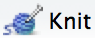

第九章 Vignettes：长篇文档
====================================

Vignette(使用指南) 是您的程序包的一篇长篇指南。如果您知道所需函数的名称，那么函数文档是便于使用的，但是在其他情况下就很难使用了。\
Vignette 就像一本书的一章或一篇学术论文：它可以描述你的程序包要解决的问题，然后向读者展示如何解决它。\
Vignette 应该将全部函数划分为多个清晰有用的类别，并演示如何协调使用多个函数来解决问题。如果想解释程序包的细节，vignette 也很有用。\
例如，如果实现了一个复杂的统计算法，那么您可能需要在一个 vignette 中描述算法的所有细节，这样程序包用户就可以了解到底发生了什么，并确信您的算法实现是正确的。

许多现有的程序包都有 vignettes。您可以使用 ``browseVignettes()`` 查看所有已安装包的 vignettes。要查看特定包的 vignette，请使用参数 ``browseVignettes("packagename")。\
每个 vignette 提供了三个文档：原始源文件、可读的 HTML 页面或 PDF，以及一个 R 代码文件。可以使用 ``vignette(x)`` 读取特定的 vignette，并使用 ``edit(vignette(x))`` 查看其代码。\
要查看尚未安装的包的 vignette，请查看其 CRAN 页面，例如: https://cran.r-project.org/web/packages/dplyr。

在 R 3.0.0 之前，只有使用 Sweave 才能够创建 vignette。这很具有挑战性，因为 Sweave 只使用 LaTeX，而且 LaTeX 既难学又难编译。现在，任何包都可以提供一个 vignette \ **引擎**\ ，\
一个将输入文件转换成 HTML 或 PDF vignette 的标准接口。在本章中，我们将使用 \ `knitr <https://yihui.name/knitr/>`__\  提供的 R Markdown vignette 引擎。我推荐这款引擎是因为：

- 您将使用 Markdown 写作，它是一个纯文本格式系统。与 LaTeX 相比，Markdown 的功能是有限的，但是这个限制是很好的，因为它迫使你专注于内容。
- 它可以混合文本、代码和结果（不论是文本还是图像）。
- \ `rmarkdown package <https://rmarkdown.rstudio.com/>`__\  进一步简化了您的工作，它通过使用 \ `pandoc <https://johnmacfarlane.net/pandoc>`__\  将 Markdown 转换为 HTML 并提供许多有用的模板来协调 Markdown 和 knitr。


从 Sweave 切换到 R Markdown 对我使用 vignette 产生了深远的影响。以前，由于制作一个 vignette 是缓慢而痛苦的，因此我很少动手。现在，vignette 是我的程序包中必不可少的一部分。\
每当我需要解释一个复杂的话题，或演示如何用多个步骤解决问题时，我都会用到它们。

目前，获得 R Markdown 的最简单方法是使用 \ `RStudio <https://www.rstudio.com/products/rstudio/download/preview/>`__\ 。RStudio 将自动安装所有需要的依赖项。如果不使用 RStudio，则需要：

- 通过 ``isntall.packages("rmarkdown")`` 安装 rmarkdown 程序包。
- \ `安装 pandoc <https://johnmacfarlane.net/pandoc/installing.html>`__\ 。


9.1 Vignette 工作流程
------------------------------

运行以下代码来创建您的第一个 vignette：

.. code-block:: R

    usethis::use_vignette("my-vignette")

这将会：

1. 创建一个 ``vignettes/`` 目录。
2. 向 ``DESCRIPTION`` 添加必要的依赖项（即，它向 ``Suggests`` 和 ``VignetteBuilder`` 字段添加字段值 knitr）。
3. 起草一个 vignette，``vignette/my-vignette.Rmd``。

草稿的设计是为了提醒你R降价文件的重要部分。当你创建一个新的小插曲时，它可以作为一个有用的参考。

一旦有了这个文件，工作流程就变得很简单：

- 修改 vignette。
- 按 Ctrl/Cmd + Shift + K（或单击 |knit| ）来生成文档并预览输出。

R Markdown vignette 有三个重要的组成部分：

- 初始元数据文本块（metadata）。
- 设置文本格式的 Markdown。
- 混合文本、代码和结果的 knitr。

这些将在接下来的各节中进行描述。


9.2 元数据
----------------

Vignette 的前几行包含重要的元数据。默认模板包含以下信息：

.. code-block:: yaml

    ---
    title: "Vignette Title"
    output: rmarkdown::html_vignette
    vignette: >
    %\VignetteIndexEntry{Vignette Title}
    %\VignetteEngine{knitr::rmarkdown}
    \usepackage[utf8]{inputenc}
    ---

这个元数据是用 \ `yaml <https://www.yaml.org/>`__\  编写的，yaml 是一种设计成既可供人阅读也可由计算机读取的格式。语法的基本原理与 ``DESCRIPTION`` 文件非常相似，其中每行由字段名、冒号和字段值组成。\
我们在这里使用的一个特殊的 YAML 特性是 ``>``。它表示以下几行文本是纯文本，不应该使用任何特殊的 YAML 特性。

字段包括：

- 标题、作者和日期：这是您放置 vignette 的标题、作者和日期的地方。您需要自己填写这些内容（如果不想在页面顶部显示标题栏，可以删除它们）。默认情况下会自动填写日期：它使用特殊的 knitr 语法（如下所述）插入今天的日期。
- Output：它会告诉 rmarkdown 使用哪个输出格式化程序。有许多选项对常规报表有用（包括 html、pdf、slideshows 等），但 ``rmarkdown::html_vignette`` 经过了专门设计，可以在程序包中正常工作。使用 ``?rmarkdown::html_vignette`` 获取更多详细信息。
- Vignette：这包含 R 所需的一个特殊的元数据文本块。在这里，您可以看到 LaTeX Vignette 的遗产：元数据看起来像 LaTeX 命令。您需要修改 ``\VignetteIndexEntry`` 以提供希望在 vignette 索引中显示的 vignette 文档标题。其余两行保持原样。它们告诉 R 使用 knitr 来处理文件，并且文件是用 UTF-8 编码的（这是编写 vignette 时应该使用的唯一编码）。


9.3 Markdown
--------------

R Markdown vignette 是用 Markdown 编写的，它是一种轻量级的标记语言。Markdown 的作者 John Gruber 总结了 Markdown 的目标和哲学：

    Markdown 的目标是尽可能地容易读写。

    然而，可读性是最重要的。Markdown 格式的文档应该可以原样发布，就像纯文本一样，而不是看起来像是用标签或格式化说明标记的。\
    Markdown 的语法受到了一些现有的 text-to-HTML 过滤器的影响，包括 Setext、atx、Textile、reStructuredText、Grutatext \
    和 EtText —— Markdown 语法的最大灵感来源是纯文本电子邮件的格式。

    为此，Markdown 的语法完全由标点符号组成，这些标点符号是经过精心选择的，以便看起来像它们本身的意思。\
    例如，一个单词周围的星号实际上看起来像是\ *强调*\ 。Markdown 列表看起来像，emmm，列表。\
    即使是方块引号也像是被引用的文本段落，如果你曾经使用过电子邮件的话。

Markdown 并不像 LaTeX、reStructuredText 或 docbook 那样强大，但它很简单，易于编写，甚至在没有渲染时也易于阅读。\
我发现 Markdown 的约束对写作很有帮助，因为它让我专注于内容，并防止我在样式设计上搞得一团糟

如果您从未使用过 Markdown，那么可以从 John Gruber 的 \ `Markdown 语法文档 <https://daringfireball.net/projects/markdown/syntax>`__\  开始。\
Pandoc 的 Markdown 实现消除了一些粗糙的功能实现，并添加了一些新特性，因此我还建议您熟悉 \ `pandoc readme <http://johnmacfarlane.net/pandoc/README.html>`__\ 。\
编辑 Markdown 文档时，RStudio 通过问号图标显示一个下拉菜单，该图标提供了一个 Markdown 参考卡片。

下面的各节向您展示了我认为 pandoc 的 Markdown 的最重要的特点。您应该能在 15 分钟内学会基本知识


9.3.1 小节（Sections）
..........................

标题由 ``#`` 标识：

.. code-block:: markdown

    # Heading 1
    ## Heading 2
    ### Heading 3

创建带有三个或更多连字符（或星号）的水平线：

.. code-block:: markdown

    --------
    ********


9.3.2 列表（Lists）
..........................

基础无序列表使用 ``*``：

.. code-block:: markdown

    * Bulleted list
    * Item 2
        * Nested bullets need a 4-space indent.
        * Item 2b

9.3.3 行内格式（Inline formating）
........................................

行内格式也很简单：

.. code-block:: markdown

    _italic_ or *italic*
    __bold__ or **bold**    
    [link text](destination)
    <http://this-is-a-raw-url.com>


9.3.4 表格（Tables）
...........................

有\ `四种类型的表 <https://pandoc.org/MANUAL.html#tables>`__\ 。我建议使用如下所示的管道符构成的表：

.. code-block:: markdown

    | Right | Left | Default | Center |
    |------:|:-----|---------|:------:|
    |   12  |  12  |    12   |    12  |
    |  123  |  123 |   123   |   123  |
    |    1  |    1 |     1   |     1  |

注意：在标题下的分隔符中使用了 ``:``。这决定了列的对齐方式。

如果表的底层数据存在于 R 中，请不要手动布局。相反，请使用 ``knitr::kable()``，或查看 \ `printr <https://github.com/yihui/printr>`__\  或 \ `pander <https://rapporter.github.io/pander/>`__\ 。


9.3.5 代码（code）
.........................

行内代码使用 ```code```

对于较大的代码块，使用 ```````。这些被称为“围墙”代码块：

.. code-block:: markdown

    ```
    # A comment
    add <- function(a, b) a + b
    ```

要向代码添加语法高亮显示，请在反引号后加上语言的名称：

.. code-block:: markdowm

    ```c
    int add(int a, int b) {
    return a + b;
    }
    ```

在打印时，pandoc 支持的语言有：actionscript、ada、apache、asn1、asp、awk、bash、bibtex、boo、c、changelog、clojure、\
cmake、coffee、coldfusion、commonlisp、cpp、cs、css、curry、d、diff、djangtemplate、doxygenlua、dtd、eiffel、email、\
erlang、fortran、fsharp、gnuassembler、go、haxe、html、ini、java，javadoc、javascript、json、jsp、julia、latex、lex、\
literatecurry、literatehaskell、lua、makefile、mandoc、matlab、maxima、metafont、mips、modula2、modula3、monobasic、\
nasm、noweb、objectivec、objectivecpp、ocaml、ocave、pascal、perl、php、pike、postscript、prolog、python、r、\
relaxcompact、rhtml、ruby、rust、scala、scheme、sci、sed、sgml、sql，sqlmysql、sqlpostgresql、tcl、texinfo、verilog、\
vhdl、xml、xorg、xslt、xul、yacc、yaml。语法高亮显示是由 haskell 包的 \ `highlighting-kate <http://johnmacfarlane.net/highlighting-kate>`__\  完成的；有关当前列表，请访问网站。）

当您在 vignette 中添加 R 代码时，通常不会使用 `````r``，而是使用由 knitr 专门处理的 `````{r}``，如下所述。


9.4 Knitr
-----------

Knitr 允许您混合代码、结果和文本。Knitr 获取 R 代码，运行它，捕获输出，并将其转换为格式化的 Markdown。Knitr 捕获所有打印的输出、\
消息、警告、错误（可选）和绘图（basic graphics, lattice & ggplot 等）。

考虑下面这个简单的例子。请注意，knitr 块看起来类似于 fenced 代码块，但不是使用 ``r``，而是使用 ``{r}``。

.. code-block:: markdown

    ​```{r}
    # Add two numbers together
    add <- function(a, b) a + b
    add(10, 20)
    ```

这将生成以下 Markdown 代码：

.. code-block:: markdown

    ```r
    # Add two numbers together
    add <- function(a, b) a + b
    add(10, 20)
    ## [1] 30
    ```

这些会被渲染成为：

.. code-block:: R

    # Add two numbers together
    add <- function(a, b) a + b
    add(10, 20)
    ## 30

一旦您开始使用 knitr，就再也不用返回检查了。因为您的代码总是在构建 vignette 时运行，所以您可以放心地知道所有代码都可以工作。您的输入和输出不可能不同步。


9.4.1 选项
.................

您可以指定附加选项来控制渲染过程：

- 要影响单个块（block），请添加块（block）设置：

.. code-block:: markdown

    ​```{r, opt1 = val1, opt2 = val2}
    # code
    ```

- 要影响全部的块（block），在 knitr block 中调用 ``knitr::opts_chunk$set()``：

.. code-block:: markdown

    ```{r, echo = FALSE}
    knitr::opts_chunk$set(
        opt1 = val1,
        opt2 = val2
    )
    ```

最重要的选项如下所示：

- ``eval = FALSE`` 阻止代码的运行。如果您想显示一些需要很长时间才能运行的代码，这很有用。使用这个选项时要小心：因为代码没有运行，所以很容易引入 BUG。（另外，当用户复制粘贴代码时，如果代码不起作用，他们会感到困惑不解。）
- ``echo = FALSE`` 关闭代码 \ *输入*\  的打印（输出仍将被打印）。一般来说，您不应该在 vignette 中使用它，因为理解代码在做什么很重要。它在编写报告时更有用，因为代码通常比输出不那么重要。
- ``results = "hide"`` 关闭代码 \ *输出*\  的打印。
- ``warning = FALSE`` 和 ``message = FALSE`` 禁止显示警告和消息。
- ``error = TRUE`` 捕获块中的所有错误并以内联的方式显示它们。如果您想演示如果代码抛出错误会发生什么，这是很有用的。无论何时使用 ``error = TRUE``，都需要使用 ``purl = FALSE``。这是因为每个 vignette 都有一个包含 vignette 中所有代码的脚本文件。R 必须在不出错的情况下生成源文件，而 ``purl = FALSE`` 会阻止出错的代码插入到该文档中。
- ``collapse = TRUE`` 和 ``comment = "#>"`` 是我显示代码输出的首选方式。我通常通过在文档开头放置以下 knitr 块来全局设置它们。

    .. code-block:: markdown

        ```{r, echo = FALSE}
        knitr::opts_chunk$set(collapse = TRUE, comment = "#>")
        ```

- ``results = "asis"`` 将 R 代码的输出视为 Markdown 文本。如果要从 R 代码生成文本，这很有用。例如，如果要使用 pander 包生成一个表格，可以执行以下操作：

    .. code-block:: markdown

        ```{r, results = "asis"}
        pander::pandoc.table(iris[1:3, 1:4])
        ```

    生成的 Markdown 表格如下所示：

    .. code-block:: markdown

        --------------------------------------------------------
        Sepal.Length   Sepal.Width   Petal.Length   Petal.Width 
        -------------- ------------- -------------- -------------
            5.1            3.5           1.4            0.2     

            4.9             3            1.4            0.2     

            4.7            3.2           1.3            0.2     
        ---------------------------------------------------------

    这会产生像这样的表格：

    =============  ============  =============  ============
    Sepal.Length   Sepal.Width   Petal.Length   Petal.Width 
    =============  ============  =============  ============
    5.1            3.5           1.4            0.2     
    4.9            3             1.4            0.2     
    4.7            3.2           1.3            0.2     
    =============  ============  =============  ============

- ``fig.show = "hold"`` 保存所有数字，直到代码块结束。
- ``fig.width = 5`` 和 ``fig.height = 5`` 设置图形的高度和宽度（以英寸为单位）。

更多的其他选项在 https://yihui.name/knitr/options。


9.5 开发周期
-----------------

使用 Cmd + Alt + C 一次运行一个代码块。在一个新的 R Session 中使用 Knit (Ctrl/Cmd + Shift + K) 重新运行整个文档。

您可以使用 ``devtools::build_vignettes()`` 从控制台构建所有 vignette，但这很少使用。相反，使用 ``devtools::build()`` 创建包含 vignette 的二进制包。
RStudio 的 "Build & reload" 通过放弃构建 vignette 来节省时间。类似的，``devtools::install_github()``（和类似的函数）默认情况下不会构建 vignette，\
因为它们很耗时，可能需要额外的程序包。您可以使用 ``devtools::install_github(build_vignettes = TRUE)`` 强制构建。这也将安装所有建议的程序包。


9.6 有关撰写 vigntte 的建议
--------------------------------

    If you’re thinking without writing, you only think you’re thinking. — Leslie Lamport

写一个 Vignette 时，您是在教别人如何使用您的程序包。因此需要设身处地为读者着想，采取一种“初学者的思维”。这可能很困难，因为很难忘记已经内化的所有知识。\
出于这个原因，我发现亲自授课是一种非常有用的方法，可以获得对我的 Vignette 的反馈。您不仅可以直接得到反馈，而且还可以更容易地了解人们已经知道的东西。

这种方法的一个有用的作用是它可以帮助您改进代码。它迫使您重新审视最初的思考流程，并意识到什么部分是困难的。每次我写文章来描述最初的经历，我都意识到我错过了一些重要的功能。\
添加这些功能不仅对我的用户有帮助，而且还经常帮助我！（这是我喜欢写书的原因之一）。

- 我强烈推荐 Kathy Sierra 写的任何文章。她以前的博客 \ `Creating passionate users <https://headrush.typepad.com/>`__\  中充满了关于编程、教学和如何创建有价值的工具的建议。我建议您通读所有旧的内容。她的新博客 \ `Serious Pony <https://seriouspony.com/blog/>`__\  没有那么多内容，但仍然有一些优秀的文章。
- 如果您想学习如何写得更好，我强烈推荐 Joseph M. Williams 和 Joseph Bizup 的 \ `Style: Lessons in Clarity and Grace <https://amzn.com/0321898680>`__\  。它可以帮助理解写作的结构，这样就能更好地识别和纠正糟糕的写作。

写一个 vignette 也可以让你从编程中得到片刻的休息。根据我的经验，与编程不同，写作使用了大脑中不同的部分，所以如果你厌倦了编程，那就试着写一点文字。（这与\ `结构化拖延 <http://www.structuredprocrastination.com/>`__\ 有关）。


9.6.1 组织
..............

对于更加简单的程序包，一个 vignette 通常就足够了。但是对于更复杂的程序包，您可能需要不止一个。事实上，您可以有任何喜欢的 vignette。\
我倾向于把它们看作一本书的章节——它们应该是自成体系的，但仍然链接在一起成为一个连贯的整体。

虽然这只是一个小的改动，但是您可以通过利用文件在磁盘上的存储方式来链接各种 vignette：为了链接到 vignette ``abc.Rmd``，只需产生一个链接到 ``abc.html``.


9.7 CRAN 注记
------------------

注意，由于您在本地构建了 vignette，所以 CRAN 只接收 html/pdf 和源代码。然而，CRAN 并不会重建这个 vignette。\
它只检查代码是否可以运行（通过运行它）。这意味着 vignette 使用的任何程序包都必须在 ``DESCRIPTION`` 中声明。\
但这也意味着即使 CRAN 没有安装 pandoc，您也可以使用 Rmarkdown（它使用 pandoc）。

常见的问题：

- Vignette 是以交互方式构建的，但是在检查时会失败，并显示有关您知道已安装的缺失程序包的错误。这意味着您忘记在 ``DESCRIPTION`` 中声明该依赖关系（通常应该在 ``Suggests`` 字段中声明）。
- 所有事情都是交互式工作的，但是在安装了程序包之后，vignette 却不出现了。这可能发生了以下几种情况之一。首先，由于 RStudio 的“build & reload”并没有构建 vignette，所以您可能需要运行 ``devtools::install()`` 。接下来检查：

    1. 目录名称为 ``vignettes/`` 而不是 ``vignette/``。
    2. 检查您是否无意中使用了 ``.Rbuildignore`` 排除了 vignette。
    3. 确保您写入了必要的 vignette 元数据。

- 如果您使用了 ``error = TRUE``，那么必须使用 ``purl = FALSE``。


您需要注意文件的大小。如果包含了大量的图片，则很容易创建一个非常大的文件。虽然没有硬性的规定，但是如果有一个非常大的 vignette，就得准备好要么证明文件大小是正确的，要么使其变小。


9.8 接下来是什么
-----------------------

如果您想对您的 vignette 的外观有更多的控制，需要学习更多关于 Rmarkdown 的知识。网站 https://rmarkdown.rstudio.com 是一个很好的起点。\
在那里，您可以了解其他输出格式（如 LaTeX 和 pdf）以及如何在需要额外控制的情况下合并原始 HTML 和 LaTeX。

如果您写了一篇不错的 vignette，考虑把它提交给 \ *Journal of Statistical Software* \ 或 \ *The R Journal*\ 。\
这两种期刊都是电子版的，并经过同行评审。评论者的评论对提高您的 vignette 和相关软件的质量非常有帮助。


