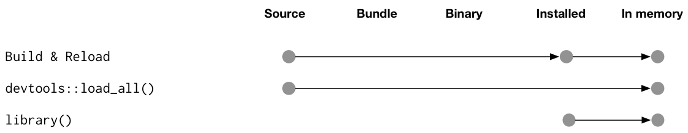

第五章 基本开发工作流程
==================================

在第 \ `4 <https://r-pkgs.org/package-structure-state.html#package-structure-state>`__\  章中\
略微了解了 R 程序包和库后，在这里，我们提供了创建程序包以及使其转变为开发过程中出现的不同状态的基本工作流。

5.1 创建程序包
--------------------

5.1.1 调查现有运行环境
..........................

许多程序包都是由于一个人对一些本应更容易完成的普通任务感到沮丧而产生的。您应该如何判断某些东西是否值得制作为程序包呢？\
虽然这个问题没有明确的答案，但了解至少两种类型的回报对您是有帮助的：

- 结果（Product）：当这个功能正式实现时，您的工作生活会变得更好。
- 过程（Progress）：更好地掌握 R 会使您的工作更有效率。

如果您只关心结果带来的好处，那么您的主要目标就是在现有的程序包中探索。Silge，Nash 和 Graves 在 useR! 2017 组织了一次调查和会议。\
他们为 R Journal（Silge、Nash 和 Graves \ `2018 <https://r-pkgs.org/workflows101.html#ref-silge-nash-graves>`__\ ）撰写的文章提供了全面的资源综述。

如果您正在寻找方法来提高对 R 的掌握，那么您仍然应该对 R 的运行环境多加了解。但是，即使有相关的前期工作，也有很多充分的理由来制作自己的程序包。\
专家们的方式是通过实践来为许多功能构建程序包，通常是非常基本的功能，并且您应该有同样的机会通过修补来学习。如果您只被允许做一些从未接触过的事情，那么您可能会遇到一些非常模糊或非常困难的问题。 \ :sub:`茫然不知所云`\ 

最后，根据用户界面、默认值和在极端情况下的表现来评估现有工具的适用性也是有效的。如果一个程序包在技术上可以满足您的需要，\
但是对于您的用例来说非常不符合舒适正确的使用方式，那么仍然可以说它不能满足您的需求。在这种情况下，开发自己的实现方法或编写隐藏了 sharp edges \ :sub:`疑问？`\  的封装函数仍然是有意义的。

5.1.2 为您的程序包取名
..............................

    “在计算机科学中只有两件困难的事：缓存失效和命名。” — Phil Karlton

在创建程序包之前，您需要为它取一个明自。这可能是创建程序包的过程中最困难的部分！（尤其是因为没有人可以为您实现取名的自动化。）

5.1.2.1 正式的要求
'''''''''''''''''''''''''

有三个正式的要求：

1. 名称只能由字母、数字和句点组成，即 ``.``。
2. 它必须以字母开头。
3. 它不能以句点结尾。

不幸的是，这意味着您不能在您的包名中使用连字符或下划线，即 ``-`` 或 ``\``。我们建议不要在包名中使用句点，因为这会混淆句点与文件扩展名和 S3 方法的关联。

5.1.2.2 实用的建议
'''''''''''''''''''''''''

如果您打算和别人分享您的程序包，那么花几分钟想一个好名字是值得的。以下是一些需要考虑的事项：

- 选择一个便于 Google 搜索的独特名称。这使得潜在的用户能够很容易地找到您的程序包（以及相关的资源），并能让您看到是谁在使用它。
- 不要选择一个已经在 CRAN 或 Bioconductor 上使用的包名。您可能还需要考虑一些其他类型的命名冲突：

    * 是否有在 GitHub 上成熟的且正在开发中的程序包，该程序包已经有了一定的历史，并且似乎即将发布？
    * 这个名称是否已经用于另一个软件，例如是 Python 或 JavaScript 生态系统中的库或框架？

- 避免同时使用大写和小写字母：这样做会使包名称难以键入，甚至难以记住。例如，很难记住一个程序包叫做 Rgtk2 还是 RGTK2 或 RGtk2。
- 优先选择可发音的名字，这样人们在谈论你的程序包时会很舒服，并且能够在他们的脑海里听到它。
- 找到一个能唤起对问题的联想的单词，并对其进行修改，使其具有唯一性：

    * lubridate 使日期和时间更容易。
    * rvest 从网页中“收获”内容。
    * r2d3 提供了使用 D3 可视化的实用程序。
    * forcats 是因子（factors）的变位词，我们用它来表示分类数据( \ **for cat**\ egorical data )。

- 使用缩写：

    * RCpp = R + C++ (Plus Plus)
    * brms = 使用 Stan 的贝叶斯回归模型（Bayesian Regression Models using Stan）
- 名字后添加额外的字符 R：

    * stringr 提供字符串工具。
    * beepr 播放通知声音。
    * callr 从 R 调用 R。

- 别被起诉。

    * 如果您要创建一个与商业服务交互的包，请查看商标使用指南。例如，rDrop 不被称为 rDropbox，因为 Dropbox 禁止任何应用程序使用完整的商标名。

Nick Tierney 在他的 \ `Naming Things <https://www.njtierney.com/post/2018/06/20/naming-things/>`__\  博客文章中展示了一个有趣的程序包名称类型学；\
请参阅该文章以获取更多鼓舞人心的示例。他也有一些重命名包的经验，因此，如果您第一次取名没有做对，他的博客文章 \ `So, you’ve decided to change your r package name <https://www.njtierney.com/post/2017/10/27/change-pkg-name/>`__\  将是一个很好的资源。

5.1.2.3 使用 available 程序包
'''''''''''''''''''''''''''''''''''

同时遵守上述所有建议是十分困难的，因此您显然需要做出一些权衡。 \ `available 程序包 <https://cran.r-project.org/package=available>`__\ 中有一个名为 ``available()`` 的函数，可以帮助您从多个角度评估可能的程序包名称：

.. code-block:: R

    library(available)

    available("doofus")
    #> Urban Dictionary can contain potentially offensive results,
    #>   should they be included? [Y]es / [N]o:
    #> 1: 1
    #> ── doofus ──────────────────────────────────────────────────────────────────
    #> Name valid: ✔
    #> Available on CRAN: ✔ 
    #> Available on Bioconductor: ✔
    #> Available on GitHub:  ✔ 
    #> Abbreviations: http://www.abbreviations.com/doofus
    #> Wikipedia: https://en.wikipedia.org/wiki/doofus
    #> Wiktionary: https://en.wiktionary.org/wiki/doofus
    #> Sentiment:???

··available::available()`` 执行以下操作：

- 检查有效性。
- 检查在 CRAN、Bioconductor 和其他产品上的可用性。
- 搜索各种网站，帮助您发现任何意料之外的含义。在交互式会话中，您在上面看到的 URLs 将在浏览器选项卡中打开。
- 试图报告该名称是否有积极情绪或消极情绪。

5.1.3 程序包的创建
...........................

为程序包命名后，有两种创建程序包的方法：

- 调用 ``usethis::create_package()``。
- 在 RStudio 中，依次点击 \ *File > New Project > New Dictionary > R Package*\ ，它最终会调用 ``usethis::create_package()``，所以实际上只有一种创建程序包的方法。

\ *TODO: revisit when I tackle usethis + RStudio project templates https://github.com/r-lib/usethis/issues/770. In particular, contemplate whether to reinstate any screenshot-y coverage of RStudio workflows here.*\ 

这将产生最小的 \ *可工作的*\  程序包，它包含三个组件：

1. 一个 ``R/`` 目录，您将在 \ `R Code <https://r-pkgs.org/r.html#r>`__\  中了解到具体内容。
2. 一个基础的 ``DESCRIPTION`` 文件，您将在 \ `package metadata <https://r-pkgs.org/description.html#description>`__\  中了解到具体内容。
3. 一个基础的 ``NAMESPACE`` 文件，您将在 \ `the namespace <https://r-pkgs.org/namespace.html#namespace>`__\  中了解到具体内容。

它也可能包含一个 RStudio 项目文件，``pkgname.Rproj``，这使您的程序包易于与 RStudio 一起使用，如下所述。基础的 ``.Rbuildignore`` 和 ``.gitignore`` 文件也被包含在目录中。

不要使用 ``package.skeleton()`` 创建程序包。因为这个函数与 R 一起提供，您可能会想使用它，但是它会创建一个在调用 R CMD build 时立刻抛出错误的程序包。\
它期望的开发过程与我们在这里使用的不同，所以修复这个损坏的初始状态只会让使用 devtools（尤其是 roxygen2）的人做不必要的工作。请使用 ``create_package()``。

5.1.4 您应该在哪里执行 ``create_package()`` ?
...........................................................

``create_package()`` 的主要且唯一必需的参数是新程序包所在的 ``path``：

.. code-block:: R

    create_package("path/to/package/pkgname")

请记住，这是您的程序包在\ **源代码**\ 形式（第 \ `4.2 <https://r-pkgs.org/package-structure-state.html#source-package>`__\  节）时所处的位置，\
而不是\ **已安装**\ 形式（第 \ `4.5 <https://r-pkgs.org/package-structure-state.html#installed-package>`__\  节）。\
已安装的包位于\ **库**\ 中，我们在第 \ `4.7 <https://r-pkgs.org/package-structure-state.html#library>`__\  节中讨论了库的常规设置。

源码包应该放在哪里？主要原则是该位置应该与已安装包所在的位置不同。在没有其他外部考虑的情况下，典型的用户应该在其主目录中为 R（源代码）包指定一个目录。\
我们与同事讨论过这一点，您最喜欢的一些 R 包的源代码位于 ``~/rrr/``、``~/documents/tidyverse/``、``~/R/packages/`` 或 ``~/pkg/`` 等目录中。\
我们中的一些人使用一个目录来实现这一点，其他人则根据他们的开发角色（contributor vs. not）、GitHub 组织（tidyverse vs r-lib）、开发阶段（active vs. not）等将源码包划分为几个目录。

以上内容可能反映出我们主要是工具构建者。学术研究人员可能会围绕单个出版物组织他们的文件，而数据科学家可能会围绕数据产品和报告来组织。\
对于每一种特定的方法，没有特定的技术或传统原因来说明为何要选择它。只要在源码包和已安装的包之间保持清晰的区别，仅仅需要选择一种在整个系统中有效的文件组织策略，并始终如一地使用它即可。

5.2 RStudio 项目
---------------------------

devtools 与 RStudio，一个我们相信是大多数 R 用户的最佳开发环境联系紧密、携手合作。明确地说，您可以使用 devtools 而不使用 RStudio，\
也可以在 RStudio 中开发程序包而不使用 devtools。但是这种特殊的、双向的关系使得一起使用 devtools 和 RStudio 变得非常有意义。
    
    |Logo|

    一个 RStudio 项目（Project，包含一个大写字母“P”），是您计算机上的一个常规目录，其中包含一些（大部分是隐藏的）RStudio 基础文件，\
    以便您在一个或多个项目（project，带有小写的“P”）上工作。一个项目（project）可以是一个 R 包、一个数据分析报告、一个 Shiny app、一本书、一个博客等等。

5.2.1 RStudio 项目的好处
...............................

从第 \ `4.2 <https://r-pkgs.org/package-structure-state.html#source-package>`__\  节中，您已经知道源码包位于您计算机上的目录中。我们强烈建议将每个源码包作为一个 RStudio 项目。以下是这样做的好处：

- 项目是非常“可启动的”（launch-able）。文件浏览器和工作目录将完全按照您需要的方式进行设置，马上可以开始工作，从而很容易在一个项目中启动一个新的 RStudio 实例，。
- 每个项目都是独立的；在一个项目中运行的代码不会影响任何其他项目。

    * 您可以同时打开多个 RStudio 项目，并且在项目 A 中执行的代码不会对项目 B 的 R session 和工作区（workspace）产生任何影响。

- 您可以使用方便的代码导航工具，如 ``F2`` 跳转到函数定义，``Ctrl + .`` 来按名称查找函数或文件。
- 您可以使用很有帮助的键盘快捷键和可点击的界面，以执行常见的程序包开发任务，如生成文档、运行测试或检查整个程序包。

.. image:: ./Image/Chapter_5/keyboard-shortcuts.png

..

    |Logo|

    查看最有用的键盘快捷键，请按 ``Alt + Shift + K``，或者使用 \ *Help > Keyboard Shortcuts Help*\ 。

..
    
    |Logo|

    在 Twitter 上关注 @\ `rstudiotips <https://twitter.com/rstudiotips>`__\  以获取 RStudio 的常规提示和使用技巧。

5.2.2 怎样开始 RStudio 项目
................................

如果您按照我们的建议使用 ``create_package()`` 创建新的程序包，那么这会自行解决。如果你在 RStudio 工作，每个新程序包也将是一个 RStudio 项目。

有多种方法可以将预先存在源码包的目录指定为 RStudio 项目：

- 在 RStudio 中，执行 \ *File > newproject > Existing Directory*\ 。
- 使用预先存在的 R 源包的路径调用 ``create_package()``。
- 调用 ``usethis::use_rstudio()``，将活动的 usethis 项目设置为现有的 R 包。实际上，这可能意味着您只需要确保工作目录在已经存在的程序包中。

5.2.3 RStudio 项目文件是什么？
..........................................

RStudio 项目的目录将包含一个 ``.Rproj`` 文件。通常，如果目录名为“foo”，则项目文件为 ``foo.Rproj``。\
如果这个目录也是一个 R 包，那么包名通常也是“foo”。故障最少的方法是使所有这些名称一致，并且\ **不要**\ 将程序包嵌套在项目内的子目录中。\
如果您决定采用其他工作流程，那么可能会让您觉得您在与工具进行不必要的争斗。

``.Rproj`` 文件只是一个文本文件。以下是 usethis 使用的默认项目文件：

.. code-block:: R

    Version: 1.0

    RestoreWorkspace: No
    SaveWorkspace: No
    AlwaysSaveHistory: Default

    EnableCodeIndexing: Yes
    Encoding: UTF-8

    AutoAppendNewline: Yes
    StripTrailingWhitespace: Yes

    BuildType: Package
    PackageUseDevtools: Yes
    PackageInstallArgs: --no-multiarch --with-keep.source
    PackageRoxygenize: rd,collate,namespace

您不需要手动修改这个文件。可以通过 \ *Tools > Project Options*\  或者右上角 Project 菜单栏中的 \ *Project Options*\  提供的界面进行编辑。

\ *TODO: update these and deal with layout.*\ 

.. image:: ./Image/Chapter_5/project-options-1.png
    :scale: 50

.. image:: ./Image/Chapter_5/project-options-2.png
    :scale: 50

5.2.4 怎样启动一个 RStudio 项目
....................................

在 macOS 的 Finder 或 Windows 资源管理器中双击 ``foo.Rproj`` 文件，以便在 RStudio 中启动 foo Project。

您也可以通过 \ *File > Open Project (in New Session)*\  或右上角的 Project 菜单从 RStudio 中启动 Projects。

如果您使用的是一个生产力应用程序或启动器应用程序，您可能可以将其配置为对 ``.Rproj`` 文件执行一些令人愉快的操作。\
我们都使用 Alfred 来实现这一点，[4]_ 只有 macOS 有该工具，但是 Windows 也有类似的工具。事实上，这是一个非常好的理由首选使用生产力应用程序。

一次性打开多个项目是非常正常的——而且富有成效！

5.2.5 RStudio Project vs. active usethis project
.............................................................

您会注意到，大多数 usethis 函数不使用路径：它们对“active usethis project”中的文件进行操作。usethis 程序包假设以下这些在 95% 的时间内都是一致的：

- 当前的 RStudio Project，如果使用 RStudio。
- 活跃的 usethat 项目。
- R 进程的当前工作目录。

如果事情看起来很奇怪，可以调用 ``proj_sitrep()`` 来获取“情况报告”。这将识别出一些特殊情况，并提出如何回到更良好的状态。

.. code-block:: R

    # these should usually be the same (or unset)
    proj_sitrep()
    #> *   working_directory: '/Users/jenny/rrr/readxl'
    #> * active_usethis_proj: '/Users/jenny/rrr/readxl'
    #> * active_rstudio_proj: '/Users/jenny/rrr/readxl'

5.3 工作目录和文件路径规范
-----------------------------------

在开发包时，您将会执行 R 代码。这将是工作流调用（例如 ``document()`` 或 ``test()``）和帮助您编写函数、\
示例和测试的\ *特殊（ad hoc）*\ 调用的混合。我们\ *强烈建议*\ 您将 R 进程的工作目录设置为源码包的顶层目录。

如果您在程序包开发方面毫无经验，那么您没有太多的基础来支持或抵制此建议。但那些有经验的人可能会觉得有些不安。\
在子目录中工作时，我们应该如何表示路径，比如 ``tests/`` ？当它变得与我们的工作相关时，\
我们将向您展示如何利用路径构建帮助器，例如 ``testthat::test_path()``，它会在执行时确定路径。

它的基本思想是，通过不使用工作目录，鼓励您编写能够明确表达意图的路径（“从测试目录中读取 ``foo.csv``），\
而不是隐式的表达（“从当前的工作目录中读取 ``foo.csv``，我\ *认为*\ 该目录将是测试目录）。\
依赖隐式路径的一个可靠迹象就是不断地修改工作目录，因为您正在使用 ``setwd()`` 手动实现路径中隐含的假设。

这种思想可以消除所有路径问题，让日常的开发变得更加愉快。隐式路径难以正确设置的原因有两个：

- 回想一下在开发周期中程序包可以采用的不同形式（第 \ `4 <https://r-pkgs.org/package-structure-state.html#package-structure-state>`__\  章）。在这些状态中，存在哪些文件和文件夹以及它们在层次结构中的相对位置都是互不相同的。编写满足所有程序包状态的相对路径是很困难的。
- 最终，您的程序包将由您和 CRAN 使用内置工具（built-in tools）处理，如 ``R CMD build``、``R CMD check`` 和 ``R CMD INSTALL``。很难跟踪这些过程中每个阶段的工作目录是什么。

像 ``testthat::test_path()``、``fs::path_package()`` 和 \ `rprojroot package <https://rprojroot.r-lib.org/>`__\  这样的路径帮助器对于构建弹性的路径非常有用，\
这些路径可以在开发和使用过程中出现的所有情况下都有效。消除脆弱路径的另一种方法是严格使用在程序包中存储数据的适当方法（第 \ `12 <https://r-pkgs.org/data.html#data>`__\  章），\
并在适当的时候采用会话（session）的临时目录，例如针对短暂的测试工件（ephemeral testing artefacts）（第 \ `10 <https://r-pkgs.org/tests.html#tests>`__\  章）。

5.4 使用 ``load_all()`` 测试函数
-------------------------------------

``load_all()`` 函数无疑是 devtools 工作流中最重要的部分。

.. code-block:: R

    # with devtools attached and
    # working directory set to top-level of your source package ...

    load_all()

    # ... now experiment with the functions in your package

``load_all()`` 是在“lather, rinse, repeat”这一程序包开发周期中的关键步骤：

1. 调整函数定义。
2. ``load_all()``
3. 通过运行一个较小的示例或一些测试来尝试更改。

当您刚接触程序包开发或 devtools 时，很容易忽视 ``load_all()`` 的重要性，并在数据分析工作流中养成一些不合适的习惯。

5.4.1 ``load_all()`` 的好处
..................................

当您第一次开始使用开发环境，如 RStudio 或 Emacs + ESS 时，最大的便利之处是能够从 ``.R`` 脚本中发送代码到 R 控制台（R console）中执行。\
这种流动性使得遵循将源代码视为真实存在\ [5]_ （而不是工作区中的对象）和保存 ``.R`` 文件（而不是保存和重新加载 ``.Rdata``）的最佳做法是可以接受的。 \ :sub:`疑惑`\ 

``load_all()`` 对于程序包开发来说有着同样的意义，相反的是，它要求您\ **不要**\ 像脚本代码那样测试程序包代码。\
``load_all()`` \ *模拟*\ 查看源代码更改效果的完整过程，这是一个非常笨重的\ [6]_ 过程，您不会希望经常这样做。``load_all()`` 的主要优点有：

- 您可以快速迭代，这将鼓励探索和渐进式开发过程。

    * 这种迭代加速对于具有编译代码的程序包来说尤其显著。

- 您可以在命名空间机制下进行交互开发，该机制准确模拟了其他人使用您的已安装程序包时的情况：

    * 您可以直接调用自己的内部函数，而不必使用 ``:::``，也不必在全局工作区中临时定义函数。
    * 您还可以从导入到 ``NAMESPACE`` 的其他程序包中调用函数，而不必试图通过 ``library()`` 附加这些依赖项。

``load_all()`` 消除了开发工作流中的麻烦，也消除了使用替代方法的诱惑，该替代方法通常会导致命名空间和依赖项管理方面的错误。

5.4.2 其它调用 ``load_all()`` 的方法
..........................................

在程序包 Project 中工作时，RStudio 提供了几种调用 ``load_all()`` 的方法：

- 键盘快捷键：Cmd + Shift + L (macOS)、Ctrl + Shift + L (Windows, Linux)
- Build 窗格的 \ *More …*\  菜单
- \ *Build > Load All*\ 

``devtools::load_all()`` 是 ``pkgload::load_all()`` 的一个简单封装，它增加了一点用户友好性。\
您不太可能以编程的方式或在另一个程序包中使用 ``load_all()``，但如果您这样做了，您可能应该直接使用 ``pkgload::load_all()``。

\ *TODO: Decide how to update this diagram and then reposition and re-integrate it with the prose. For example, figure out how to frame w.r.t. RStudio Install and Restart vs. Clean and Rebuild.*\ 

参考文献
------------

Silge, Julia, John C. Nash, and Spencer Graves. 2018. “Navigating the R Package Universe.” The R Journal 10 (2):558–63. https://doi.org/10.32614/RJ-2018-058.

.. rubric:: 脚注

.. [4] 具体来说，当建议打开应用程序或文件时，我们配置 Alfred 在其搜索结果中优先打开 ``.Rproj`` 文件。要向 Alfred 注册 ``.Rproj`` 文件类型，请转到 \ *Preferences > Features > Default Results > Advanced*\ 。将任意 ``.Rproj`` 文件拖到此位置，然后关闭即可。↩
.. [5] 引用 \ `Emacs Speaks Statistics <https://ess.r-project.org/Manual/ess.html#Philosophies-for-using-ESS_0028R_0029>`__\  (ESS) 所支持的使用哲学。↩
.. [6] 使用命令行的方法是退出 R，转到 shell，在程序包的父目录中执行 ``R CMD build foo``，然后执行 ``R CMD INSTALL foo_x.y.x.tar.gz``，重新启动 R，并调用 ``library(foo)``。在 R 中，一个近似的做法是 ``detach("package:foo", unload = TRUE); install.packages(".", repos = NULL, type = "source"); library(foo)``。↩

