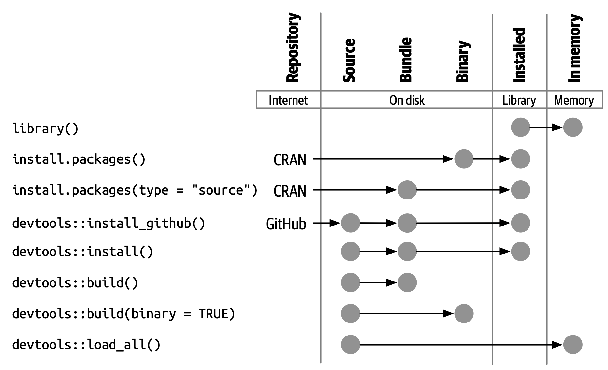

# 软件包结构与状态 {#sec-package-structure-state}

```{r, echo = FALSE}
source("common.R")
```

本章将会把你从*使用* R 包中获得的隐式知识转化为*创建和修改* R 包所需的显式知识，从而使你踏上 R 软件包开发之路。
你将会了解到软件包可能处于的各种状态，以及包 (package) 和库 (library) 之间的区别（以及为什么你应该关心这些区别）。

## 软件包状态 {#sec-package-states}

当你创建或修改软件包时，需要在它的“源代码”或“源文件”上进行。
你会以**源代码**的形式和正在开发中的包进行交互。
当然，这并不是你在日常使用中最熟悉的软件包形式。
但是，如果你了解 R 包可能处于的五种状态，那么软件包开发工作流将变得更有意义：

-   源代码状态 (source)
-   打包状态 (bundled)
-   二进制文件状态 (binary)
-   已安装状态 (installed)
-   载入内存状态 (in-memory)

你可能已经了解一些将软件包置于这些状态的函数。
例如，`install.packages()` 函数可以将软件包从源代码状态、打包状态或二进制文件状态转为已安装状态。
`devtools::install_github()` 函数获取 GitHub 上的源代码软件包并将其转为已安装状态。
而 `library()` 函数将已安装的软件包加载到内存中，使其立即可以直接使用。

## 源码包 (Source Package) {#sec-source-package}

一个**源代码**软件包就是一个有着特定结构的文件目录。
它包含特定的组件，例如一个 `DESCRIPTION` 文件，包含 `.R` 文件的 `R/` 目录等等。
本书其余的大部分章节都致力于详细介绍这些组件。

如果你刚刚接触 R 包开发，那么你可能从未见过源代码形式的软件包！
你的计算机上甚至可能没有任何源码包。
以源代码形式查看软件包的最简单的方法是在网站上浏览其代码。

许多 R 包是在 GitHub（或者 GitLab 以及类似的平台）上公开开发的。
要找到它们的网址，最好的情况是你能够访问软件包的 CRAN 主页 (landing page)，例如：

-   forcats: <https://cran.r-project.org/package=forcats>
-   readxl: <https://cran.r-project.org/package=readxl>

页面中一个 URL 会链接到公共托管服务上的存储库，例如：

-   forcats: <https://github.com/tidyverse/forcats>
-   readxl: <https://github.com/tidyverse/readxl>

即使这个包是在公共存储库中开发的，有时候一些维护者会忘记列出这个 URL，但是你仍然可以通过搜索发现它。

即使软件包不是在公共平台上开发的，你也可以通过 [由 R-hub 维护的非官方只读镜像](https://docs.r-hub.io/#cranatgh) 来访问其源代码，例如：

-   MASS: <https://github.com/cran/MASS>
-   car: <https://github.com/cran/car>

请注意，在 `cran` GitHub 组织中探索软件包的源代码及其开发历史并不等同于探索软件包真正的开发场所，因为里面的源代码和演变历史只是根据它在 CRAN 的正式发布版本 (release) 中通过逆向工程提取出来的。
我们看到的这只是对软件包及其开发历史的一种编辑结果，但根据定义，它仍然包含了所有必需的内容。

## 归档包 (Bundled Package)[^bundled-package] {#sec-bundled-package}

[^bundled-package]:译者注：“归档”一词在中国大陆的用语习惯中较少使用，但考虑 `tar` 的原意，确实有“为一个版本创建只读快照”的含义，和这里的 R 包相符。

一个**归档打包的**软件包是被压缩成单个文件的软件包。
按照惯例（该惯例来自 Linux），R 中的归档包使用 `.tar.gz` 扩展名，有时候也被称为 "source tarballs"。
这意味着多个文件已经被打包为一个文件 (`.tar`) 并使用 gzip (`.gz`) 进行压缩。
虽然归档包本身并不那么有用，但它是源码包和已安装包之间平台无关、便于传输的中间媒介。

在从本地开发的软件包中生成归档包这种罕见的情况下，请使用 `devtools::build()` 函数。
在幕后，它会调用 `pkgbuild::build()` 并最终调用 `R CMD build`，这些内容会在 [Writing R Extensions](https://cran.r-project.org/doc/manuals/R-exts.html) 的 [Building package tarballs](https://cran.r-project.org/doc/manuals/R-exts.html#Building-package-tarballs) 章节中进行更多阐述。 

这应该会提醒你，归档包或 "source tarball" 不仅仅是对源文件进行 tar 打包归档，然后使用 gzip 压缩的结果。
按照惯例，在 R 世界中，在制作 `.tar.gz` 文件时还要执行一些操作，而这就是为什么我们选择在本书中将这种形式称为**归档包**的原因。

每一个 CRAN 软件包都以归档包的形式提供，可以通过软件包主页 (landing page) 中 "Package source" 字段获取。
继续我们上面的示例，你可以下载归档包 `forcats_0.4.0.tar.gz` 和 `readxl_1.3.1.tar.gz`（或者任何当前的版本）。
你可以在 shell（而不是 R 控制台）中进行解压：

``` bash
tar xvf forcats_0.4.0.tar.gz
```

如果解压一个归档包，你会发现它看起来几乎与源码包相同。
@fig-package-files 展示了一个名为 zzzpackage 的虚构软件包的源码包、归档包和二进制包中的文件。
我们精心设计了这个示例，以包含本书中涉及的大部分软件包组件。
不过，不是每个软件包都包含这里看到的每个文件，这个图也不包括包中可能出现的每个文件。

```{r}
#| label: fig-package-files
#| echo: false
#| out-width: ~
#| fig-cap: >
#|   软件包形式：源代码 vs. 归档 vs. 二进制。
#| fig-alt: >
#|   源码包、归档包和二进制包之间并列比较。
#|   展示了从软件包源代码到打包状态，再到二进制状态的流向（包括路径和格式）
#|   这一过程将在本章适当命名的章节中
#|   进行详细介绍。
knitr::include_graphics("diagrams/package-files.png")
```

未压缩的归档包相比于源码包的主要区别为：

-   已经构建了主题文档 (vignettes)，因此渲染好的输出文件，例如 HTML 会出现在 `inst/doc/` 目录下，并且主题文档 (vignette) 索引会出现在 `build/` 目录中。

-   本地源码包可能包含用于在开发期间节省时间的临时文件，例如 `src/` 中的编译产物 (compilation artifacts)。
    这些文件不会在归档包中出现。

-   `.Rbuildignore` 中列出的任何文件都不包含在捆绑包中。
    这些文件通常有助于你的开发过程，但应该从分发的最终产品中排除。

### `.Rbuildignore` {#sec-rbuildignore}

你不需要经常考虑 `.tar.gz` 形式的软件包的确切结构，但你确实需要了解 `.Rbuildignore` 文件。
它决定了源码包中的哪些文件可以进入后面的工作流。

`.Rbuildignore` 的每一行都是一个 Perl 兼容的正则表达式 (Perl-compatible regular expression, PCRE)，它会在不考虑大小写的情况下与源码包中每个文件的路径进行匹配[^structure-1]。
如果正则表达式匹配到了文件或目录，那么该文件或目录将会被排除，无法进入之后的软件包开发工作流。
注意，有一些默认排除项由 R 本身执行，主要与经典的版本控制系统和编辑器（例如 SVN, Git 和 Emacs）有关。

[^structure-1]: 要查看会参与匹配的所有文件路径的集合，请在软件包的顶层目录执行命令 `dir(full.names = TRUE, recursive = TRUE, include.dirs = TRUE, all.files = TRUE)`。

我们通常使用 `usethis::use_build_ignore()` 函数来修改 `.Rbuildignore`，该函数能够帮助你处理一些容易遗忘的细节，例如正则表达式的添加定位锚点 (anchoring) 和转义 (escaping)。
要排除特定的文件或目录（这是最常见的用例），**必须**为正则表达式添加定位锚点 (anchor)。
例如，如果要排除一个名为 "notes" 的目录，`.Rbuildignore` 中对应条目必须是 `^notes$`，而没有添加定位锚点的正则表达式 `notes` 将会匹配任意包含 "notes" 的文件名，例如 
`R/notes.R`, `man/important-notes.R`, `data/endnotes.Rdata` 等。
我们发现 `use_build_ignore()` 有助于我们第一次就更准确地获取更多的 `.Rbuildignore` 条目。

`.Rbuildignore` 提供了一种解决方式，能够协调支持开发流程的常规做法和 CRAN 对软件包提交和分发的要求之间的一些紧张关系 (@sec-release)。
即使你不打算在 CRAN 上发布你的软件包，遵循这些约定也能让你充分地利用 R 的内置工具来检查和安装程序包。
你应该添加到 `.Rbuildignore` 中的文件分为两个半重叠的类别：

-   帮助你以编程方式生成软件包内容的文件。例如：
    -   使用 `README.Rmd` 生成信息丰富且最新的 `README.md` (@sec-readme)。
    -   储存用于创建和更新内部或导出数据的 `.R` 脚本 (@sec-data-data-raw)。
-   在 CRAN 的要求之外驱动软件包开发、检查和文档的文件。例如：
    -   和 RStudio IDE 有关的文件 (@sec-workflow101-rstudio-projects)。
    -   使用 [pkgdown package](https://pkgdown.r-lib.org) 生成的软件包网站 (@sec-website)。
    -   与持续集成/部署有关的配置文件 (@sec-sw-dev-practices-ci)。

以下是一个 `.Rbuildignore` 文件非详尽的典型条目列表，来自 tidyverse 包：

```         
^.*\.Rproj$         # 指定目录为 RStudio 项目的文件
^\.Rproj\.user$     # RStudio 使用的临时文件
^README\.Rmd$       # 用于生成 README.md 的 Rmd 文件
^LICENSE\.md$       # 许可证全文
^cran-comments\.md$ # CRAN 提交的评论意见
^data-raw$          # 用于创建软件包中包含的数据的代码
^pkgdown$           # 用于软件包网站的资源文件
^_pkgdown\.yml$     # 软件包网站的配置文件
^\.github$          # GitHub Actions 工作流
```

注意，上面的注释不能出现在实际的 `.Rbuildignore` 文件中，它们在这里只是为了说明文件作用。

当你需要向 `.Rbuildignore` 中添加文件时，我们会在书中提到。
请记住 `usethis::use_build_ignore()` 是管理这类文件的一种有吸引力的方法。
此外，许多 usethis 函数在添加一个应该列在 `.Rbuildignore` 中的文件时会自动处理这个问题。
例如 `use_readme_rmd()` 会将 "\^README\\.Rmd\$" 添加到 `.Rbuildignore`。

## 二进制包 (Binary Package) {#sec-structure-binary}

如果你想把你的包分发给没有软件包开发工具的用户，则需要提供**二进制**包文件。
二进制包最主要的制作者和分发者是 CRAN，而不是单个维护者。
但是，即使你将分发包的责任委托给 CRAN，对于维护人员来说，理解二进制包的性质仍然很重要。

像一个捆绑包一样，一个二进制包是一个单独的文件。
但是与捆绑包不同，二进制包是特定于平台的，有两种基本类型：Windows 和 macOS。
（Linux 用户通常需要拥有从 `.tar.gz` 文件安装软件包所必须的工具，尽管 [Posit Public Package Manager](https://packagemanager.posit.co/) 等资源的出现使得 Linux 用户能够像 Windows 和 macOS 用户一样访问并从二进制包安装。）

macOS 上的二进制包是以 `.tgz` 为后缀的文件，而 Windows 上的二进制包则以 `.zip` 作为文件后缀。
如果你需要制作一个二进制包，则需要在相关的平台上使用 `devtools::build(binary = TRUE)`。
在幕后，该函数调用 `pkgbuild::build(binary= TRUE)` 并且最终调用 `R CMD INSTALL --build`，这一命令会在 [Writing R Extensions](https://cran.r-project.org/doc/manuals/R-exts.html) 中的 [Building binary packages](https://cran.r-project.org/doc/manuals/R-exts.html#Building-binary-packages) 进行更详细的叙述。
如果你选择在 CRAN 上发布你的软件包 (@sec-release)，你需要以归档包的形式提交软件包，然后 CRAN 会创建并分发包二进制包文件。

CRAN 软件包通常以二进制形式提供，适用于 macOS 和 Windows，且适用于 R 的当前、历史和（可能的）开发版本。
继续上面的例子，你可以下载如下所示的二进制包：

-   macOS 上的 forcats：`forcats_0.4.0.tgz`
-   Windows 上的 readxl：`readxl_1.3.1.zip`

实际上，当你调用 `install.packages()` 时，这就是在幕后通常会发生的一部分事情。

如果你解压一个二进制包，你会看到其内部结构和源码包或归档包非常不同。
@fig-package-files 包含了二者的比较，所以现在是重温这个图的好时机。
以下是一些最显著的区别：

-   `R/` 目录下不再有 `.R` 文件，而是有三个文件以高效的文件格式存储着解析后的函数。
    这基本上是加载所有R代码然后用 `save()` 保存函数的结果。
    （在此过程中会添加一些额外的元数据，以使函数加载过程尽可能快）。

-   一个 `Meta/` 目录中包含一些 `.rds` 文件。
    这些文件中包含关于软件包的缓存元数据，例如帮助文档涵盖的主题以及 `DESCRIPTION` 文件的解析版本。
    （你可以使用 `readRDS()` 来查看这些文件中的确切内容）。
    这些文件通过缓存昂贵的计算结果使软件包加载过程更快。

-   实际的帮助内容出现在 `help/` 和 `html/` 中（不再出现在 `man/` 中）。

-   如果 `src/` 目录下有任何代码，那么现在会有一个 `libs/` 目录，其中包含代码编译后的结果。

-   如果 `data/` 目录下有任何数据对象，它们现在已经被转换为更高效的数据格式。

-   `inst/` 目录下的内容被移动到顶层目录，
    例如，主题文档 (vignette) 文件现在在 `doc/` 目录下。

-   一些文件和文件夹被删除了，例如 `README.md`、`build/`、`tests/` 和 `vignettes/`。

## 已安装的包 (Installed package) {#sec-installed-package}

An **installed** package is a binary package that's been decompressed into a package library (described in @sec-library).
@fig-installation illustrates the many ways a package can be installed, along with a few other functions for converting a package from one state to another.
This diagram is complicated!
In an ideal world, installing a package would involve stringing together a set of simple steps: source -\> bundle, bundle -\> binary, binary -\> installed.
In the real world, it's not this simple because there are often (faster) shortcuts available.

```{r}
#| label: fig-installation
#| echo: false
#| out-width: ~
#| fig-cap: >
#|   Many methods for converting between package states.
#| fig-alt: > 
#|   A chart showing different ways to go from one package state to another:
#|   1. library() puts an installed package into memory.
#|   2. Functions such as install.packages(),
#|      devtools::install_github(), and devtools::install()
#|      can install a package starting variously in the source,
#|      bundle, or binary forms.
#|   3. devtools::build() can create a bundle or a binary.
#|   4. devtools::load_all() puts a source package into memory.

```

The built-in command line tool `R CMD INSTALL` powers all package installation.
It can install a package from source files, a bundle (a.k.a. a source tarball), or a binary package.
Details are available in the [Installing packages section](https://cran.r-project.org/doc/manuals/R-admin.html#Installing-packages) of [R Installation and Administration](https://cran.r-project.org/doc/manuals/R-admin.html).
Just like with `devtools::build()`, devtools provides a wrapper function, `devtools::install()`, that makes this tool available from within an R session.

::: callout-tip
## RStudio

RStudio can also help you install your in-development package via the *Install* and *More* drop-downs in the *Build* pane and with *Install Package* in the *Build* menu.
:::

Most useRs understandably like to install packages from the comfort of an R session and directly from CRAN.
The built-in function `install.packages()` meets this need.
It can download the package, in various forms, install it, and optionally attend to the installation of dependencies.

There is a price, however, for the convenience of installing R packages from within an R session.
As you might expect, it can be a bit tricky to re-install a package that is already in use in the current session.
This actually works most of the time, but sometimes it does not, especially when installing an R package with compiled code on Windows.
Due to how file handles are locked on Windows, an attempt to install a new version of a package that's in use can result in a corrupt installation where the package's R code has been updated, but its compiled code has not.
When troubleshooting, Windows users should strive to install packages in a clean R session, with as few packages loaded as possible.

The pak package (<https://pak.r-lib.org/>) is a relative newcomer (at the time of writing) and provides a promising alternative to `install.packages()`, as well as other more specialized functions such as `devtools::install_github()`.
It's too early to make a blanket recommendation for using pak for all of your package installation needs, but we are certainly using it more and more in our personal workflows.
One of pak's flagship features is that it nicely solves the "locked DLL" problem described above, i.e. updating a package with compiled code on Windows.
As you get deeper into package development, you will find yourself doing a whole new set of tasks, such as installing a dependency from an in-development branch or scrutinizing package dependency trees.
pak provides a rich toolkit for this and many other related tasks.
We predict that pak will soon become our official recommendation for how to install packages (and more).

However, in the meantime, we describe the *status quo*.
devtools has long offered a family of `install_*()` functions to address some needs beyond the reach of `install.packages()` or to make existing capabilities easier to access.
These functions are actually maintained in the [remotes package](https://remotes.r-lib.org) and are re-exported by devtools.
(Given what we said above, it is likely that remotes will essentially become superseded, in favor of pak, but we're not quite there yet.)

```{r}
library(remotes)

funs <- as.character(lsf.str("package:remotes"))
grep("^install_.+", funs, value = TRUE)
```

`install_github()` is the most useful of these functions and is also featured in @fig-installation.
It is the flagship example of a family of functions that can download a package from a remote location that is not CRAN and do whatever is necessary to install it and its dependencies.
The rest of the devtools/remotes `install_*()` functions are aimed at making things that are technically possible with base tooling a bit easier or more explicit, such as `install_version()` which installs a specific version of a CRAN package.

Analogous to `.Rbuildignore`, described in section @sec-rbuildignore, `.Rinstignore` lets you keep files present in a package bundle out of the installed package.
However, in contrast to `.Rbuildignore`, this is rather obscure and rarely needed.

## 内存中的包 (In-memory package)

我们终于讲到了一个每个使用 R 的人都熟悉的命令：

```{r, eval = FALSE}
library(usethis)
```

假设你已经安装了 usethis，这个函数调用会使得 usethis 包的所有函数都能够使用，也就是说，我们现在可以直接执行函数：

```{r, eval = FALSE}
create_package("/path/to/my/coolpackage")
```

usethis 包现在已经被载入了内存，实际上，它也被附加到了搜索路径中。
在编写脚本时，载入和附加软件包之间的区别并不重要，但是当你编写软件包时却非常重要。
你将在 @sec-dependencies-attach-vs-load 中了解到它们之间的区别和重要性。

`library()` 并不是迭代地调整和测试驱动一个软件包的好方法，因为它只对已安装的包起作用。
在 @sec-workflow101-load-all 中你将会了解到 `devtools::load_all()` 是如何通过允许你直接将源码包加载到内存中来加速开发的。

## 软件包库 (Package libraries) {#sec-library}

我们刚刚讨论了 `library()` 函数，它的名称源于其功能。
当你调用 `library(somepackage)` 时，R 会在当前的所有**库**中查找一个叫做“somepackage”的已安装包，如果查找成功，R 会使得 somepackage 包变得可用。

在 R 中，一个**库**就是一个包含了许多已安装软件包的目录，有点像藏书的图书馆。
不幸的是，在 R 的世界，我们会经常遇到“库 (library)”和“包 (package)”这两个词的混淆用法。
例如，delyr 实际上是一个包 (package)，但是也有人通常将其称为一个库 (library)
造成这种混乱的原因有几个。
首先，R 的术语有争议地违背了更广泛的编程惯例，“库 (library)”的通常含义更接近于我们所说的“包 (package)”。
`library()` 函数的名称可能会强化这一错误的关联。
最后，这种词汇错误通常是无害的，因此 R 用户很容易养成错误的习惯，然而指出这个错误的人会看起来像是令人无法忍受的学究。
但是最重要的事实是：

> 我们使用 `library()` 函数来加载[^structure-2]一个**软件包**。

[^structure-2]: 好吧，实际上 `library()` 会加载并附加一个软件包，不过这是 @sec-dependencies-attach-vs-load 的主题。

当你参与软件包开发中时，这两者的区别时重要且有用的。

你的计算机上可以有多个库。
事实上，你们中的很多人已经这样做了，尤其是 Windows 用户。
你可以使用 `.libPaths()` 来查看当前处于活动状态的库。
以下是在 Windows 中该函数的输出结果：

```{r, eval = FALSE}
# on Windows
.libPaths()
#> [1] "C:/Users/jenny/Documents/R/win-library/4.2"
#> [2] "C:/Program Files/R/R-4.2.2/library"

lapply(.libPaths(), list.dirs, recursive = FALSE, full.names = FALSE)
#> [[1]]
#>   [1] "abc"           "anytime"       "askpass"       "assertthat"   
#>  ...
#> [145] "zeallot"      
#> 
#> [[2]]
#>  [1] "base"         "boot"         "class"        "cluster"     
#>  [5] "codetools"    "compiler"     "datasets"     "foreign"     
#>  [9] "graphics"     "grDevices"    "grid"         "KernSmooth"  
#> [13] "lattice"      "MASS"         "Matrix"       "methods"     
#> [17] "mgcv"         "nlme"         "nnet"         "parallel"    
#> [21] "rpart"        "spatial"      "splines"      "stats"       
#> [25] "stats4"       "survival"     "tcltk"        "tools"       
#> [29] "translations" "utils"
```

以下是在 macOS 中的表现（你的输出内容可能有所不同）：

```{r, eval = FALSE}
# on macOS
.libPaths()
#> [1] "/Users/jenny/Library/R/arm64/4.2/library"
#> [2] "/Library/Frameworks/R.framework/Versions/4.2-arm64/Resources/library"

lapply(.libPaths(), list.dirs, recursive = FALSE, full.names = FALSE)
#> [[1]]
#>    [1] "abc"                  "abc.data"             "abind"                
#>  ...
#> [1033] "Zelig"                "zip"                  "zoo"                 
#> 
#> [[2]]
#>  [1] "base"         "boot"         "class"        "cluster"     
#>  [5] "codetools"    "compiler"     "datasets"     "foreign"     
#>  [9] "graphics"     "grDevices"    "grid"         "KernSmooth"  
#> [13] "lattice"      "MASS"         "Matrix"       "methods"     
#> [17] "mgcv"         "nlme"         "nnet"         "parallel"    
#> [21] "rpart"        "spatial"      "splines"      "stats"       
#> [25] "stats4"       "survival"     "tcltk"        "tools"       
#> [29] "translations" "utils"
```

在这两种情况下，我们都看到了两个活动的库，查询顺序如下：

1.  用户库
2.  系统级或全局级的库

这样的设置在 Windows 中是典型设置，但在 macOS 和 Linux 上通常需要手动配置[^structure-3]。
在该设置下，从 CRAN（或其它源）或本地开发中安装的附加软件包会被保存到用户库中。
和上面一样，macOS 系统是我们主要的开发机器，并且安装了很多软件包（大约 1000 个），而 Windows 系统只是偶尔会被使用，而且要简朴得多。
R 附带的基础和推荐软件包的核心集合位于系统级库中，这一点在所有操作系统上是相同的。
这种分离对许多开发人员来说很有吸引力，例如能够使得清理附加软件包变得更容易，且不会干扰 base R 的安装。

[^structure-3]: 如果想知道更多的详细信息，请参阅 *What They Forgot To Teach You About R* 中的 [Maintaining R section](https://rstats.wtf/maintaining-r#how-to-transfer-your-library-when-updating-r), *R Installation and Administration* 中的 [Managing Libraries](https://rstudio.github.io/r-manuals/r-admin/Add-on-packages.html#managing-libraries) 以及使用 `?Startup` 和 `?.libPaths` 查看 R 的帮助文档。

如果你使用 macOS 或 Linux，并且只看到了一个库，你不需要紧急更改任何内容。
但是下次升级 R 时，请考虑创建一个用户级库。
默认情况下，R 会在环境变量 `R_LIBS_USER` 存储的路径中查找用户库路径，在 macOS 中该环境变量默认为 `~/Library/R/m/x.y/library,`，而在 Linux 中则默认是 `~/R/m-library/x.y`（其中 `m` 是对 CPU 架构的简明描述，而 `x.y` 是 R 版本号）。
你可以通过 `Sys.getenv("R_LIBS_USER")` 来查看当前的用户库路径。
默认情况下，这些目录不存在，必须通过创建目录来启用它们。
当你安装一个新版本的 R 时，在安装任何软件包之前，请使用 `dir.create(Sys.getenv("R_LIBS_USER"), recursive = TRUE)` 在默认位置上创建一个用户库。
现在，你将拥有如上所示的库设置。
或者，你也可以在其它任何地方设置一个用户库，并通过在 `.Renviron` 中设置 `R_LIBS_USER` 环境变量来告诉 R 用户库的位置。
编辑你的 `.Renviron` 文件的最简单方法是使用 `usethis::edit_r_environ()`，如果文件不存在，这一函数将会创建该文件，并打开它进行编辑。

这些库的文件路径也清楚地表明它们与特定版本的 R（在本书写作时是 4.2.x）相关联，这是常见的情况。
这一特点反映并强调了这样一个事实，当你将 R 从 4.1 更新到 4.2 ，即在**次要**版本号上进行更新时，你需要重新安装软件包。
对于在**补丁**版本号上的更新，例如从 4.2.1 更新到 4.2.2 时，通常不需要重新安装软件包。

随着你开始越来越精密和复杂地使用 R，开始更有目的地管理软件包库是很正常的。
例如，像 [renv](https://rstudio.github.io/renv/)（以及它的前身 [packrat](https://rstudio.github.io/packrat/)）这样的工具能够自动化管理特定于项目的库。
这对于使数据产品具有可复制性、可移植性和相互隔离性来说十分重要。
软件包开发者可能会在库搜索路径前添加一个临时库，其中包含一组特定版本的包，以便在不影响其它日常工作的情况下探索向后和向前兼容性问题。
反向依赖检查 (Reverse dependency checks) 是我们显式管理库搜索路径的另一个例子。

以下是按范围和持久性排序的一些主要开关，用于控制哪些库处于活动状态：

-   环境变量，例如 `R_LIBS` 和 `R_LIBS_USER`，它们在 R 启动时被查询；
-   调用 `.libPaths()` 时传入一个或多个文件路径作为库路径；
-   通过 `withr::with_libpaths()` 使用临时更改的库搜索路径执行小段代码；
-   函数的参数，例如 `install.packages(lib =)` 以及 `library(lib.loc =)`。

最后，重要的是要注意 `library()` 永远不应该在**软件包内**使用。
软件包和脚本依赖于不同的机制来声明它们的依赖关系，这是你需要在心智模型和习惯中做出的最大调整之一。
我们会在 @sec-description-imports-suggests 和 @sec-dependencies-in-practice 中详细讨论这一主题。
