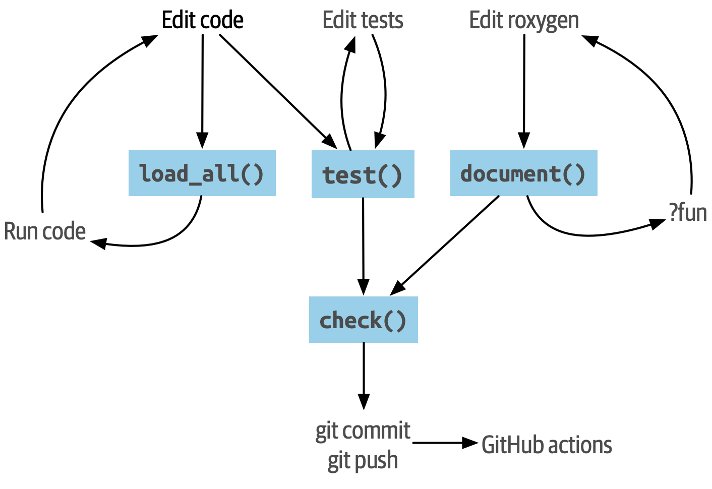

# 整个流程 {#sec-whole-game}

```{r, include = FALSE, R.options = list(tidyverse.quiet = TRUE)}
source("common.R")
library(glue)
library(fs)
library(tidyverse)

# Whenever any chunk changes, we want to re-run _every_ chunk
rmd <- parsermd::parse_rmd("whole-game.Rmd")
chunks <- parsermd::rmd_select(rmd, parsermd::has_type("rmd_chunk"))
knitr::opts_chunk$set(
  cache = TRUE,
  cache.extra = digest::digest(chunks)
)

# By default, knitr saves loaded packages and reloads at the start of the
# the new session. This doesn't work for our toy package because it is
# deleted at the end of this Rmd. So we just hack knitr to not save or load
# the package info
assignInNamespace(
  "cache", ns = "knitr",
  modifyList(knitr:::cache, list(library = function(...) {}))
)

# do you want to see how this sausage is made?
debug <- FALSE

# do we build the toy package? if so, where?
# NA            --> no, don't build it
# "tmp_user"    --> build in ~/tmp/TOYPACKAGE, so it's easy to access after
# "tmp_session" --> build in session temp dir, it's disposable
where <- "tmp_session"
```

*剧透警告！*

本章介绍了一个小型示例软件包的开发过程。
其目的是勾勒出整体的蓝图，为我们深入讨论 R 包的关键组件之前提供一个工作流程的概览。

为了保持快节奏，我们充分利用 devtools 包和 RStudio 集成开发环境（IDE）中提供的现代便利工具。在后续的章节中，我们会更详细地说明这些辅助工具是如何帮助我们的。

这一章的内容是独立的，因为完成练习并不是继续阅读本书其余部分的严格要求，但是我们强烈建议你跟着我们一起创建这个示例软件包。

## 加载 devtools 和 相关程序包

你可以从任何活动的 R 会话中初始化新的软件包。
无需担心当前是在一个已存在的项目中还是新项目中，
我们使用的函数会确保为这个软件包创建一个新的干净的项目。

首先需要加载 devtools 包, 它是一组支持软件包开发各个方面的包的公开接口。
其中最明显的是 usethis 包，你可以看到它也会被加载。

```{r}
library(devtools)
```

你现在安装的是旧版本的 devtools 包吗？
比较一下你的版本和我们的版本，必要时可以进行升级。

```{r}
packageVersion("devtools")
```

## 示例软件包：regexcite

为了帮助你完成这个过程，我们使用 devtools 包中的各种函数从头开始构建一个小型示例软件包，其中包含了已发布软件包中常见的功能：

-   用于满足特定需求的函数，在本例中是用于处理正则表达式的辅助函数。
-   版本控制和开放的开发过程。
    -   在你的工作中这一配置是完全可选的，但我们强烈建议这样做。你将看到 Git 和 GitHub 如何帮助我们展示示例软件包开发的所有中间阶段。
-   能够访问已建立的工作流程^[译者注：可能指能够执行例如安装、构建文档等标准工作流程。]，进行软件包安装、获取帮助和检查质量。
    -   使用 [roxygen2](https://roxygen2.r-lib.org) 为每个函数建立文档。
    -   使用 [testthat](https://testthat.r-lib.org) 进行单元测试。
    -   通过一个可执行的 README 文件 `README.Rmd` 来整体展示软件包。

我们把这个软件包命名为 **regexcite**，它包含了几个函数，能够让使用正则表达式的常见任务变得更加容易。
请注意，这些函数非常简单，我们在这里使用它们只是为了引导你完成软件包开发过程。
如果你正在寻找使用正则表达式的辅助函数，这里有几个合适的 R 包可以解决这个问题：

-   [stringr](https://stringr.tidyverse.org)（使用 stringi）
-   [stringi](https://stringi.gagolewski.com/)
-   [rex](https://cran.r-project.org/package=rex)
-   [rematch2](https://cran.r-project.org/package=rematch2)

同样，regexcite 包本身只是一个设备，用于演示使用 devtools 进行软件包开发的典型工作流。

## 看看成品

我们使用了 Git 版本控制系统来跟踪 regexcite 包开发的整个过程。
这一配置完全是可选的，你完全可以在不实现这一配置的情况下继续跟着进行其他步骤。
但是它有一个附加的好处，我们最终会将它连接到 GitHuub 上的远程储存库，这意味着你能够通过访问 GitHub 上的 regexcite 库来浏览我们努力取得的光荣成果： <https://github.com/jennybc/regexcite>。
通过检查 [commit history](https://github.com/jennybc/regexcite/commits/main)，特别是版本差异，你可以准确地看到在下面列出的流程中，每个步骤发生了哪些更改。

<!-- TODO: I think these diffs are extremely useful and would like to surface them better here. -->

## `create_package()`

调用 `create_package()` 来初始化计算机上指定目录中的新软件包。
如果该目录不存在，`create_package()` 将会自动创建该目录（通常都是这种情况）。
有关创建软件包的更多信息，请参阅 @sec-workflow101-create-package。

慎重选择创建软件包的目录。
它应该在你的主目录 (home) 中，与其他 R 项目放在一起。
另外它不应该嵌套在其他 RStudio 项目、R 包或 Git 储存库中。
它也不应该在 R 软件包库 (R package library) 中，里面包含了已经构建和安装的包。
将我们在这里创建的源码包转换为已安装的包是 devtools 功能的一部分。
不要自己完成 devtools 能够完成的事情！

一旦你选择了创建这个软件包的位置，将下面 `create_package()` 中的路径替换为你选择的路径并调用：

```{r create-package-fake, eval = FALSE}
create_package("~/path/to/regexcite")
```

为了创建这本书，我们必须在一个临时目录中工作，因为这本书是在云中以非交互方式构建的。
在幕后，我们正在执行我们自己的 `create_package()` 命令，如果我们的输出与你的略有不同，请不要感到惊讶。

```{r configure, include = FALSE}
where <- match.arg(
  as.character(where),
  choices = c(NA, "tmp_user", "tmp_session")
)
create <- !is.na(where)

where <- switch(
  where,
  tmp_user = path_home("tmp"),
  tmp_session = path_temp(),
  NULL
)

pkgpath <- path(where, "regexcite")

if (!is.null(where)) {
  if (requireNamespace("regexcite", quietly = TRUE)) {
    remove.packages("regexcite")
    unloadNamespace("regexcite")
  }
  if (dir_exists(pkgpath)) {
    dir_delete(pkgpath)
  }
  dir_create(where)
}
```

```{r create-package, eval = create, echo = debug}
withr::with_options(
  list(usethis.description = NULL),
  create_package(pkgpath, open = FALSE, rstudio = TRUE)
)
```

```{r set-proj-and-wd, include = debug, eval = create}
(owd <- getwd())
local_project(pkgpath, setwd = TRUE)
getwd()

# I normally am not this masochistic, but there is little choice
knitr::opts_knit$set(root.dir = pkgpath)
```

```{r sitrep, include = debug, eval = create}
# can't be in chunk above, because knitr
proj_sitrep()
```

如果你正在 RStudio 中工作，你应该会发现自己进入了一个新的 RStudio 程序界面，它在新的 regexcite 软件包项目目录中打开。
如果你出于某种原因需要手动执行这个操作，请进入该目录并双击 `regexcite.Rproj`。
RStudio 对于软件包项目做了特殊处理，你应该可以在 *Environment* 和 *History* 所在的窗格中看到一个 *Build* 选项卡。 

你可能需要再次调用 `library(devtools)`，因为 `create_package()` 可能已经在新的软件包目录中启动了一个新的 R 会话。

```{r eval = FALSE}
library(devtools)
```

在这个新目录里的内容是一个 R 包，也许还是个 RStudio 项目？
这里是一个文件清单（在本地，您可以查看 *Files* 窗格^[译者注：原文为 pane，准确来说是 tab。]）：

```{r init-show-files, echo = FALSE, eval = create}
dir_info(all = TRUE) %>% 
  select(path, type) %>%
  knitr::kable()
```

::: callout-tip
## RStudio

在 *Files* 窗格^[译者注：原文为 pane，准确来说是 tab。]中，依次点击 *More（齿轮图标） \> Show Hidden Files* 来切换隐藏文件（也称为 ["dotfiles"](https://en.wikipedia.org/wiki/Hidden_file_and_hidden_directory#Unix_and_Unix-like_environments)）的可见性。
一些文件是始终可见的，但有时你可能会希望看到全部的文件。
:::

-   `.Rbuildignore` 列出了我们开发 R 包时需要的，但是从源代码构建 R 包时并不应该包含进来的文件。如果你不使用 RStudio，`create_package()` 一开始可能并不会创建这个文件（同样也不会创建 `.gitignore`），因为没有 RStudio 相关的机制需要被忽略。然而，无论你使用的是什么编辑器，都可能在某些时候产生对 `.Rbuildignore` 的需求。@sec-rbuildignore 将对此进行更加详细的讨论。
-   `.Rproj.user`，如果有的话，它会是 RStudio 内部使用的目录。
-   `.gitignore` 为 Git 的使用做好准备。它将忽略一些由 R 和 RStudio 创建的标准的幕后文件。即使你不打算使用 Git，它也并不会产生妨害。
-   `DESCRIPTION` 提供了有关软件包的元数据。我们很快将开始编写这个文件，同时 @sec-description 涵盖了 `DESCRIPTION` 文件的常用内容。
-   `NAMESPACE` 声明了软件包导出以供外部使用的函数以及软件包从其他包导入的外部函数。现在，除了一个注释声明这是一个我们不应该手动编辑的文件外，它是空的。
-   `R/` 目录是你的软件包的“业务端”。它很快将包含带有函数声明的 .R 文件。
-   `regexcite.Rproj` 是使得该目录成为 RStudio 项目的文件。即使你不使用 RStudio，这个文件也没有妨害。或者你可以使用 `create_package(..., rstudio = FALSE)` 来避免创建该文件，详见 @sec-workflow101-rstudio-projects。

## `use_git()`

regexcite 目录是一个 R 源码包，同时也是一个 RStudio 项目。
现在，我们使用 `use_git()` 让它变成一个 Git 储存库。
（顺便一提，`use_git()` 可以在任何项目中工作，不论它是否是一个 R 包。）

```{r use-git, eval = create}
use_git()
```

在交互式会话中，系统将询问你是否要在此处提交 (commit) 这些文件，一般来说会选择提交。
在幕后，我们也将提交这些相同的文件。

```{r gert-begin, eval = create, include = debug}
suppressPackageStartupMessages(library(gert))
git_add(".")
git_commit("Initial commit")
```

那么在软件包中发生了什么变化呢？
可以发现只创建了 `.git` 目录，这个目录在大多数环境中都是隐藏的，包括 RStudio 文件浏览器
它的存在证明我们确实在这个目录下初始化了 Git 存储库。

```{r post-git-file-list, echo = FALSE, eval = create}
dir_info(all = TRUE, regexp = "^[.]git$") %>% 
  select(path, type) %>%
  knitr::kable()
```

如果你使用的是 RStudio，它可能会请求在此项目中重新启动，遵从它的请求即可。
你也可以通过关闭 RStudio 然后双击 `regexcite.Rproj` 来手动重新启动RStudio。
现在，除了软件包的开发支持外，你也可以在 *Environment/History/Build* 窗格中的 *Git* 选项卡访问一个基础的 Git 客户端。

<!-- TODO: good place for a screenshot. -->

点击 History（Git 窗格中的时钟图标），如果你之前同意了提交，你将会看到一个通过 `use_git()` 完成的初始提交。

```{r inspect-first-commit, echo = FALSE, eval = create}
git_log(max = 1) %>% 
  select(commit, author, message) %>%
  mutate(commit = paste0(substr(commit, 1, 10), "...")) %>%
  knitr::kable()
```

::: callout-tip
## RStudio

只要你配置了 RStudio + Git 集成环境，RStudio 可以在任何项目中初始化一个 Git 储存库，即使该项目不是一个 R 软件包。
依次点击 *Tools \> Version Control \> Project Setup*。
然后选择 *Version control system: Git* 来*为这个项目初始化一个新的 git 储存库*。
:::

## 编写第一个函数

在处理字符串时，一个相当常见的任务是需要将单个字符串拆分为许多部分。
base R中的 `strsplit()` 函数就是完成这个任务的。

```{r}
(x <- "alfa,bravo,charlie,delta")
strsplit(x, split = ",")
```

仔细看看返回值。

```{r}
str(strsplit(x, split = ","))
```

这个返回值的形状常常使人们感到惊讶，或者至少使他们感到不方便。
函数输入是长度为 1 的字符向量，而函数输出则是长度为 1 的列表。
考虑到 R 向矢量化演进的基本趋势，这是完全有意义的。
但有时它仍然有点讨人厌。
通常情况下，你知道你的输入在逻辑上是一个标量，即它只是一个单一的字符串，并且希望输出包含它各部分的字符向量。

这导致 R 用户采用各种方法对输出结果进行列表展开 (unlist)：

```{r}
unlist(strsplit(x, split = ","))

strsplit(x, split = ",")[[1]]
```

上面的第二种更安全的解决方案是 regexcite 的首个函数 —— `strsplit1()` 的基础: 

```{cat strsplit1-write, eval = create, class.source = "r"}
#| engine.opts = list(file = path("R", "strsplit1.R"))
strsplit1 <- function(x, split) {
  strsplit(x, split = split)[[1]]
}
```

这本书不会教你如何用 R 写函数。
要了解更多信息，请查看 R for Data Scienc 的 [Functions chapter](https://r4ds.hadley.nz/functions.html) 以及 Advanced R 的 [Functions chapter](https://adv-r.hadley.nz/functions.html)。

::: callout-tip
`strsplit1()` 的名字是对非常方便的 `paste0()` 的致敬，它首次出现在 2012 年的 R 2.15.0 中。
创建 `paste0()` 是为了解决 `paste()` *不使用*分隔符将字符串连接在一起的极其常见的用例。
`paste0()` 被亲切地描述为 ["statistical computing's most influential contribution of the 21st century"](https://simplystatistics.org/posts/2013-01-31-paste0-is-statistical-computings-most-influential-contribution-of-the-21st-century/).

`strsplit1()` 函数非常鼓舞人心，现在它是 stringr 包中的一个真正的函数： `stringr::str_split_1()`!
:::

## `use_r()`

`strsplit1()` 的函数定义应该放在哪里呢？
它应该被保存在软件包的 `R/` 子目录下的 `.R` 文件中。
一个合理的处理方法是为包中每个面向用户的函数创建一个新的 `.R` 文件，并用函数名命名对应文件。
当你添加更多函数时，你可能会希望放宽一点这个要求，并将相关函数分组组织在一起。
我们将会把 `strsplit1()` 的函数定义保存在文件 `R/strsplit1.R` 中。

辅助函数 `use_r()` 会在 `R/` 目录下创建和（或）打开对应脚本文件。
在一个开发逐渐成熟的软件包中，当你需要在 `.R` 文件以及关联的测试文件之间切换时，它真的很好用。
但是，即使在目前刚开始开发的阶段，它在防止你自己沉迷于在 `Untitled4` 中工作也是很有帮助的。

```{r init-strsplit1, eval = create}
use_r("strsplit1")
```

将 `strsplit1()` 的函数定义，并且**只有 `strsplit1()` 的函数定义**放在 `R/strsplit1.R` 文件中并保存。
文件 `R/strsplit1.R` 不应该包含其他任何我们最近执行的顶层代码，例如我们用于实践的输入 `x`、`library(devtools)` 或 `use_git()`。
这预示着从编写 R 脚本过渡到编写 R 包时需要进行的调整。
软件包和脚本使用不同的机制来声明它们对其他包的依赖性，并存储示例或测试代码。
我们将在 @sec-r 中进一步讨论这一点。

## `load_all()` {#sec-whole-game-load-all}

我们应该如何测试 `strsplit1()`？
如果这是一个普通的 R 脚本，我们可以使用 RStudio 将函数定义发送到 R 控制台，并在全局环境中定义 `strsplit1()`。
或者我们可以调用 `source("R/strsplit1.R")`。
然而，对于软件包开发来说，devtools 提供了一种更健壮的方法。

调用 `load_all()` 来使 `strsplit1()` 可以用于测试运行。

```{r load-all, eval = create}
load_all()
```

现在可以调用 `strsplit1(x)` 来看看它是如何工作的。

```{r, eval = create}
(x <- "alfa,bravo,charlie,delta")
strsplit1(x, split = ",")
```

请注意 `load_all()` 会使得 `strsplit1()` 函数可以使用，尽管它在全局环境中并不存在。

```{r, eval = create}
exists("strsplit1", where = globalenv(), inherits = FALSE)
```

如果你的运行结果是 `TRUE` 而不是 `FALSE`，这意味着你仍然在使用面向脚本的工作流，并导入了你脚本的源代码。
下面是回到正轨的方法：

-   清理你的全局环境并重启 R。
-   使用 `library(devtools)` 重新载入 devtools 并调用 `load_all()` 来重新加载 regexcite 包。
-   重新定义测试输入 `x`，然后再次调用 `strsplit1(x, split = ",")`。这应该可以正常执行！
-   再次运行 `exists("strsplit1", where = globalenv(), inherits = FALSE)`，此时你应该可以看到输出了 `FALSE`。

`load_all()` 模拟了构建、安装和载入 regexcite 软件包的过程。
当你的软件包积累了更多的函数时，有的函数导出供用户使用，而有的没有，有的函数会互相调用而有的从依赖的其他包中调用，使用 `load_all()` 相比于在全局工作空间中测试函数，能够使你对于软件包的开发过程有更为准确的了解。
同样的，`load_all()` 对于构建、安装和载入软件包的过程，能够允许更加快速的迭代。
有关 `load_all()` 的更多信息，请参阅 @sec-workflow101-load-all。

到目前为止的内容：

-   我们以及编写了第一个函数 `strsplit1()`，它用于将一个字符串拆分为一个字符向量（而不是包含字符向量的列表）。
-   我们使用 `load_all()` 来快速地让这个函数可以用于交互式使用，就好像我们已经构建安装了 regexcite 并通过 `library(regexcite)` 载入了这个软件包一样。

::: callout-tip
## RStudio

RStudio 在 *Build* 菜单中，或者在 *Build* 窗格中通过依次点击 *More \> Load All* 提供了 `load_all()` 的快捷调用，另外使用快捷键 Ctrl + Shift + L (Windows & Linux) 或 Cmd + Shift + L (macOS) 也可以快速调用该函数。
:::

### 提交对 `strsplit1()` 的更改

如果你正在使用 Git，你可以使用你喜欢的方法来提交新的 `R/strsplit1.R` 文件。
我们在幕后也进行了这一操作，这是提交前后的差异。

```{r strsplit1-commit, eval = create, include = debug}
git_add(path("R", "strsplit1.R"))
git_commit("Add strsplit1()")
## tags might be useful for making stable links to the package at specific
## evolutionary stages
## possible convention: tag name = chunk label
#tag_name <- knitr::opts_current$get("label")
#tag(repo, tag_name, "initial creation of strsplit1()")
#tag(repo, "strsplit1-init", "initial creation of strsplit1()")
#sha <- (commits(repo)[[1]])@sha
```

```{r add-strsplit1-diff, echo = FALSE, eval = create, comment = ""}
cat(git_diff_patch(ref = "HEAD"))
```

从这一节后，我们会在每一步执行完后进行提交。
请记住[这些提交](https://github.com/jennybc/regexcite/commits/main)在公开储存库中都是可见的。

## `check()`

我们现在有非正式的经验证据表明 `strsplit1()` 工作正常。
但是，我们如何确保 regexcite 包的所有可变部分仍然工作呢？
在这么小的一个增加之后，检查其他部分似乎很愚蠢，但养成经常检查的习惯是很有益处的。

在 shell 中执行的 `R CMD check` 是检查 R 包是否处于完全工作状态的黄金标准。
`check()` 是在不离开 R 会话的情况下运行这一操作的方便方法。

请注意 `check()` 生成的输出相当庞大，针对交互式使用进行了优化。
我们在这里截取了一部分，并展示一个摘要。
你本地运行 `check()` 的输出会有所不同。

```{r first-check-fake, eval = FALSE}
check()
```

```{r first-check, eval = create, warning = TRUE, echo = FALSE, comment = ""}
shhh_check(error_on = "never")
```

*阅读检查的输出是十分必要的！*请尽可能早并经常性地解决出现的问题。
这就像在 `.R` 和 `.Rmd` 文件上进行增量开发。
你检查每件事是否正常的时间间隔越长，就越难找到问题所在并解决问题。

在这一步中，我们收到了 1 个警告 (warnings)（0 个错误 (errors)，0 个提示信息 (notes)）：

```         
Non-standard license specification:
  `use_mit_license()`, `use_gpl3_license()` or friends to pick a
  license
```

我们将会完全按照它所说的去做，完全解决这一问题。
你可以在 @sec-workflow101-r-cmd-check 中了解更多有关 `check()` 的信息。

::: callout-tip
## RStudio

RStudio 在 *Build* 菜单中，或者在 *Build* 窗格中通过点击 *Check* 提供了 `check()` 的快捷调用，另外使用快捷键 Ctrl + Shift + E (Windows & Linux) 或 Cmd + Shift + E (macOS) 也可以快速调用该函数。
:::

## 编辑 `DESCRIPTION`

`DESCRIPTION` 文件提供了关于你的软件包的元数据，这在 @sec-description 中有完整的介绍。
现在是查看 regexcite 当前 `DESCRIPTION` 的好时机。
你将看到它被填充了样板内容，这些内容需要替换

要添加你自己的元数据，请进行以下编辑操作：

-   让自己成为作者。如果你没有 ORCID，你可以忽略 `comment = ...` 部分。
-   在 `Title` 和 `Description` 字段中写一些描述性文字。

::: callout-tip
## RStudio

在 RStudio 中使用 Ctrl + `.` 然后输入 "DESCRIPTION" 来激活辅助功能，这样可以轻松打开指定文件进行编辑。
除了可以输入文件名外，还可以输入函数名。
当软件包具有大量文件时，这一功能十分便利。
:::

当你完成上面的操作后，`DESCRIPTION` 的文件内容应该和下面类似：

<!-- I'm trying to avoid any syntax highlighting here, while also not trying to do things in a way that's acceptable to O'Reilly who wants "text". -->

```{cat DESCRIPTION-write, eval = create, class.source = "text"}
#| engine.opts = list(file = "DESCRIPTION")
Package: regexcite
Title: Make Regular Expressions More Exciting
Version: 0.0.0.9000
Authors@R: 
    person("Jane", "Doe", , "jane@example.com", role = c("aut", "cre"))
Description: Convenience functions to make some common tasks with string
    manipulation and regular expressions a bit easier.
License: `use_mit_license()`, `use_gpl3_license()` or friends to pick a
    license
Encoding: UTF-8
Roxygen: list(markdown = TRUE)
RoxygenNote: 7.1.2
```

```{r commit-description, eval = create, include = debug}
git_add("DESCRIPTION")
git_commit("Edit DESCRIPTION")
```

## `use_mit_license()`

> [Pick a License, Any License. -- Jeff Atwood](https://blog.codinghorror.com/pick-a-license-any-license/)

我们目前在 `DESCRIPTION` 的 `License` 字段中有一个占位符，该占位符故意设置为无效的，并提供了一种解决方案。

```         
License: `use_mit_license()`, `use_gpl3_license()` or friends to pick a
    license
```

要为软件包配置有效的许可证，请调用 `use_mit_license()`。

```{r use-mit-license, eval = create}
use_mit_license()
```

这将会把 `License` 字段正确地设置为 MIT 许可证，该许可证要求在 `LICENSE` 文件中写入版权持有人和年份。
打开新创建的 `LICENSE` 文件然后确保它看起来和下面的类似：

```{r reveal-LICENSE, eval = create, echo = FALSE, comment = ""}
writeLines(readLines("LICENSE"))
```

就像其他创建许可证的辅助函数一样，`use_mit_license()` 还会将完整的许可证副本放入 `LICENSE.md` 文件中，并将这个文件添加到 `.Rbuildignore`。
最好的做法是在软件包的源代码中包含完整的许可证文本，就像在 GitHub 中一样，但是 CRAN 禁止在软件包源代码中包含这一文件。
你可以在 @sec-license 中找到更多有关添加许可证的内容。

```{r commit-license, eval = create, include = debug}
git_add(c(".Rbuildignore", "DESCRIPTION", "LICENSE", "LICENSE.md"))
git_commit("Use MIT license")
```

## `document()` {#sec-whole-game-document}

Wouldn't it be nice to get help on `strsplit1()`, just like we do with other R functions?
This requires that your package have a special R documentation file, `man/strsplit1.Rd`, written in an R-specific markup language that is sort of like LaTeX.
Luckily we don't necessarily have to author that directly.

We write a specially formatted comment right above `strsplit1()`, in its source file, and then let a package called [roxygen2](https://roxygen2.r-lib.org) handle the creation of `man/strsplit1.Rd`.
The motivation and mechanics of roxygen2 are covered in @sec-man.

If you use RStudio, open `R/strsplit1.R` in the source editor and put the cursor somewhere in the `strsplit1()` function definition.
Now do *Code \> Insert roxygen skeleton*.
A very special comment should appear above your function, in which each line begins with `#'`.
RStudio only inserts a barebones template, so you will need to edit it to look something like that below.

If you don't use RStudio, create the comment yourself.
Regardless, you should modify it to look something like this:

```{cat strsplit1-with-roxygen-write, eval = create, class.source = "r"}
#| engine.opts = list(file = path("R", "strsplit1.R"))
#' Split a string
#'
#' @param x A character vector with one element.
#' @param split What to split on.
#'
#' @return A character vector.
#' @export
#'
#' @examples
#' x <- "alfa,bravo,charlie,delta"
#' strsplit1(x, split = ",")
strsplit1 <- function(x, split) {
  strsplit(x, split = split)[[1]]
}
```

<!-- TODO: mention how RStudio helps you execute examples here? -->

```{r commit-strsplit1-roxygen-header, eval = create, include = debug}
git_add(path("R", "strsplit1.R"))
git_commit("Add roxygen header to document strsplit1()")
```

But we're not done yet!
We still need to trigger the conversion of this new roxygen comment into `man/strsplit1.Rd` with `document()`:

```{r document-strsplit1, eval = create}
document()
```

::: callout-tip
## RStudio

RStudio exposes `document()` in the *Build* menu, in the *Build* pane via *More \> Document*, and in keyboard shortcuts Ctrl + Shift + D (Windows & Linux) or Cmd + Shift + D (macOS).
:::

You should now be able to preview your help file like so:

```{r eval = FALSE}
?strsplit1
```

You'll see a message like "Rendering development documentation for 'strsplit1'", which reminds that you are basically previewing draft documentation.
That is, this documentation is present in your package's source, but is not yet present in an installed package.
In fact, we haven't installed regexcite yet, but we will soon.
If `?strsplit1` doesn't work for you, you may need to call `load_all()` first, then try again.

Note also that your package's documentation won't be properly wired up until it has been formally built and installed.
This polishes off niceties like the links between help files and the creation of a package index.

### `NAMESPACE` 的更改

In addition to converting `strsplit1()`'s special comment into `man/strsplit1.Rd`, the call to `document()` updates the `NAMESPACE` file, based on `@export` tags found in roxygen comments.
Open `NAMESPACE` for inspection.
The contents should be:

<!-- OK to use this approach here because I actively do not want a copy button. NAMESPACE should be managed by roxygen and I don't want to tempt anyone to edit it by hand. -->

```{r asis = TRUE, echo = FALSE, comment = "", eval = create}
cat(readLines("NAMESPACE"), sep = "\n")
```

The export directive in `NAMESPACE` is what makes `strsplit1()` available to a user after attaching regexcite via `library(regexcite)`.
Just as it is entirely possible to author `.Rd` files "by hand", you can manage `NAMESPACE` explicitly yourself.
But we choose to delegate this to devtools (and roxygen2).

```{r commit-namespace, eval = create, include = debug}
git_add(c("NAMESPACE", path("man", "strsplit1.Rd")))
git_commit("Run document()")
```

## 再次 `check()`

regexcite 应该可以在现在并且永远干净地通过 `R CMD check`，并且 0 错误 (errors)，0 警告 (warnings)，0 提示信息 (notes)。

```{r first-clean-check-fake, eval = FALSE}
check()
```

```{r first-clean-check, eval = create, warning = TRUE, echo = FALSE, comment = ""}
shhh_check(error_on = "never")
```

## `install()`

Now that we know we have a minimum viable product, let's install the regexcite package into your library via `install()`:

```{r first-install-fake, eval = FALSE}
install()
```

```{r first-install, eval = create, echo = FALSE, comment = ""}
cat(pretty_install(), sep = "\n")
```

::: callout-tip
## RStudio

RStudio exposes similar functionality in the *Build* menu and in the *Build* pane via *Install and Restart*, and in keyboard shortcuts Ctrl + Shift + B (Windows & Linux) or Cmd + Shift + B (macOS).
:::

After installation is complete, we can attach and use regexcite like any other package.
Let's revisit our small example from the top.
This is also a good time to restart your R session and ensure you have a clean workspace.

```{r, eval = create}
library(regexcite)

x <- "alfa,bravo,charlie,delta"
strsplit1(x, split = ",")
```

Success!

## `use_testthat()`

We've tested `strsplit1()` informally, in a single example.
We can formalize this as a unit test.
This means we express a concrete expectation about the correct `strsplit1()` result for a specific input.

First, we declare our intent to write unit tests and to use the testthat package for this, via `use_testthat()`:

```{r use-testthat, eval = create}
use_testthat()
```

This initializes the unit testing machinery for your package.
It adds `Suggests: testthat` to `DESCRIPTION`, creates the directory `tests/testthat/`, and adds the script `tests/testthat.R`.
You'll notice that testthat is probably added with a minimum version of 3.0.0 and a second DESCRIPTION field, `Config/testthat/edition: 3`.
We'll talk more about those details in @sec-testing-basics.

```{r commit-testthat-init, eval = create, include = debug}
git_add(c("DESCRIPTION", path("tests", "testthat.R")))
git_commit("Add testing infrastructure")
```

However, it's still up to YOU to write the actual tests!

The helper `use_test()` opens and/or creates a test file.
You can provide the file's basename or, if you are editing the relevant source file in RStudio, it will be automatically generated.
For many of you, if `R/strsplit1.R` is the active file in RStudio, you can just call `use_test()`.
However, since this book is built non-interactively, we must provide the basename explicitly:

```{r test-strsplit1, eval = create}
use_test("strsplit1")
```

This creates the file `tests/testthat/test-strsplit1.R`.
If it had already existed, `use_test()` would have just opened it.
You will notice that there is an example test in the newly created file - delete that code and replace it with this content:

```{r include = debug, eval = create}
test_path <- path("tests", "testthat", "test-strsplit1.R")
```

```{cat strsplit1-test-write, eval = create, class.source = "r"}
#| engine.opts = list(file = test_path)
test_that("strsplit1() splits a string", {
  expect_equal(strsplit1("a,b,c", split = ","), c("a", "b", "c"))
})
```

This tests that `strsplit1()` gives the expected result when splitting a string.

```{r commit-strsplit1-test, eval = create, include = debug}
git_add(test_path)
git_commit("Test strsplit1()")
```

Run this test interactively, as you will when you write your own.
If `test_that()` or `strsplit1()` can't be found, that suggests that you probably need to call `load_all()`.

Going forward, your tests will mostly run *en masse* and at arm's length via `test()`:

<!-- TODO: I have no idea why I have to disable crayon here, but if I don't, I guess raw ANSI escapes. Other chunks seem to work fine with downlig. It would also be nice to not see evidence of progress reporting, but the previous approach to turning that off keeps this chunk from showing any output at all :( The previous approach was `R.options = list(testthat.default_reporter = testthat::ProgressReporter$new(update_interval = Inf))`. -->

```{r, include = FALSE}
library(testthat) # suppress package loading messages
```

```{r eval = create, R.options = list(crayon.enabled = FALSE)}
test()
```

::: callout-tip
## RStudio

RStudio exposes `test()` in the *Build* menu, in the *Build* pane via *More \> Test package*, and in keyboard shortcuts Ctrl + Shift + T (Windows & Linux) or Cmd + Shift + T (macOS).
:::

Your tests are also run whenever you `check()` the package.
In this way, you basically augment the standard checks with some of your own, that are specific to your package.
It is a good idea to use the [covr package](https://covr.r-lib.org) to track what proportion of your package's source code is exercised by the tests.
More details can be found in @sec-testing-basics.

## `use_package()`

You will inevitably want to use a function from another package in your own package.
We will need to use package-specific methods for declaring the other packages we need (i.e. our dependencies) and for using these packages in ours.
If you plan to submit a package to CRAN, note that this even applies to functions in packages that you think of as "always available", such as `stats::median()` or `utils::head()`.

One common dilemma when using R's regular expression functions is uncertainty about whether to request `perl = TRUE` or `perl = FALSE`.
And then there are often, but not always, other arguments that alter how patterns are matched, such as `fixed`, `ignore.case`, and `invert`.
It can be hard to keep track of which functions use which arguments and how the arguments interact, so many users never get to the point where they retain these details without rereading the docs.

The stringr package "provides a cohesive set of functions designed to make working with strings as easy as possible".
In particular, stringr uses one regular expression system everywhere (ICU regular expressions) and uses the same interface in every function for controlling matching behaviors, such as case sensitivity.
Some people find this easier to internalize and program around.
Let's imagine you decide you'd rather build regexcite based on stringr (and stringi) than base R's regular expression functions.

First, declare your general intent to use some functions from the stringr namespace with `use_package()`:

```{r use-stringr, eval = create}
use_package("stringr")
```

This adds the stringr package to the `Imports` field of `DESCRIPTION`.
And that is all it does.

```{r commit-stringr-imports, eval = create, include = debug}
git_add("DESCRIPTION")
git_commit("Import stringr")
```

Let's revisit `strsplit1()` to make it more stringr-like.
Here's a new take on it[^whole-game-1]:

[^whole-game-1]: Recall that this example was so inspiring that it's now a real function in the stringr package: \`stringr::str_split_1()\`!

```{r str-split-one-sneak-peek, eval = FALSE}
str_split_one <- function(string, pattern, n = Inf) {
  stopifnot(is.character(string), length(string) <= 1)
  if (length(string) == 1) {
    stringr::str_split(string = string, pattern = pattern, n = n)[[1]]
  } else {
    character()
  }
}
```

Notice that we:

-   Rename the function to `str_split_one()`, to signal that it is a wrapper around `stringr::str_split()`.
-   Adopt the argument names from `stringr::str_split()`. Now we have `string` and `pattern` (and `n`), instead of `x` and `split`.
-   Introduce a bit of argument checking and edge case handling. This is unrelated to the switch to stringr and would be equally beneficial in the version built on `strsplit()`.
-   Use the `package::function()` form when calling `stringr::str_split()`. This specifies that we want to call the `str_split()` function from the stringr namespace. There is more than one way to call a function from another package and the one we endorse here is explained fully in @sec-dependencies-in-practice.

Where should we write this new function definition?
If we want to keep following the convention where we name the `.R` file after the function it defines, we now need to do some fiddly file shuffling.
Because this comes up fairly often in real life, we have the `rename_files()` function, which choreographs the renaming of a file in `R/` and its associated companion files below `test/`.

```{r}
rename_files("strsplit1", "str_split_one")
```

Remember: the file name work is purely aspirational.
We still need to update the contents of these files!

Here are the updated contents of `R/str_split_one.R`.
In addition to changing the function definition, we've also updated the roxygen header to reflect the new arguments and to include examples that show off the stringr features.

```{cat str-split-one-write, eval = create, class.source = "r"}
#| engine.opts = list(file = path("R", "str_split_one.R"))
#' Split a string
#'
#' @param string A character vector with, at most, one element.
#' @inheritParams stringr::str_split
#'
#' @return A character vector.
#' @export
#'
#' @examples
#' x <- "alfa,bravo,charlie,delta"
#' str_split_one(x, pattern = ",")
#' str_split_one(x, pattern = ",", n = 2)
#'
#' y <- "192.168.0.1"
#' str_split_one(y, pattern = stringr::fixed("."))
str_split_one <- function(string, pattern, n = Inf) {
  stopifnot(is.character(string), length(string) <= 1)
  if (length(string) == 1) {
    stringr::str_split(string = string, pattern = pattern, n = n)[[1]]
  } else {
    character()
  }
}
```

Don't forget to also update the test file!

Here are the updated contents of `tests/testthat/test-str_split_one.R`.
In addition to the change in the function's name and arguments, we've added a couple more tests.

```{cat str-split-one-test-write, eval = create, class.source = "r"}
#| engine.opts = list(file = path("tests", "testthat", "test-str_split_one.R"))
test_that("str_split_one() splits a string", {
  expect_equal(str_split_one("a,b,c", ","), c("a", "b", "c"))
})

test_that("str_split_one() errors if input length > 1", {
  expect_error(str_split_one(c("a,b","c,d"), ","))
})

test_that("str_split_one() exposes features of stringr::str_split()", {
  expect_equal(str_split_one("a,b,c", ",", n = 2), c("a", "b,c"))
  expect_equal(str_split_one("a.b", stringr::fixed(".")), c("a", "b"))
})
```

Before we take the new `str_split_one()` out for a test drive, we need to call `document()`.
Why?
Remember that `document()` does two main jobs:

1.  Converts our roxygen comments into proper R documentation.
2.  (Re)generates `NAMESPACE`.

The second job is especially important here, since we will no longer export `strsplit1()` and we will newly export `str_split_one()`.
Don't be dismayed by the warning about `"Objects listed as exports, but not present in namespace: strsplit1"`.
That always happens when you remove something from the namespace.

```{r document-str-split-one, eval = create}
document()
```

Try out the new `str_split_one()` function by simulating package installation via `load_all()`:

```{r str-split-one-test-drive, eval = create}
load_all()
str_split_one("a, b, c", pattern = ", ")
```

```{r commit-str-split-one, eval = create, include = debug}
git_add(c(
  "NAMESPACE",
  path("man", c("str_split_one.Rd", "strsplit1.Rd")),
  path("R", c("str_split_one.R", "strsplit1.R")),
  path("tests", "testthat", c("test-str_split_one.R", "test-strsplit1.R"))
))
git_commit("Switch to str_split_one()")
```

## `use_github()`

You've seen us making commits during the development process for regexcite.
You can see an indicative history at <https://github.com/jennybc/regexcite>.
Our use of version control and the decision to expose the development process means you can inspect the state of the regexcite source at each developmental stage.
By looking at so-called diffs, you can see exactly how each devtools helper function modifies the source files that constitute the regexcite package.

How would you connect your local regexcite package and Git repository to a companion repository on GitHub?
Here are three approaches:

1.  [`use_github()`](https://usethis.r-lib.org/reference/use_github.html) is a helper that we recommend for the long-term. We won't demonstrate it here because it requires some credential setup on your end. We also don't want to tear down and rebuild the public regexcite package every time we build this book.
2.  Set up the GitHub repo first! It sounds counter-intuitive, but the easiest way to get your work onto GitHub is to initiate there, then use RStudio to start working in a synced local copy. This approach is described in Happy Git's workflows [New project, GitHub first](https://happygitwithr.com/new-github-first.html) and [Existing project, GitHub first](https://happygitwithr.com/existing-github-first.html).
3.  Command line Git can always be used to add a remote repository *post hoc*. This is described in the Happy Git workflow [Existing project, GitHub last](https://happygitwithr.com/existing-github-last.html).

Any of these approaches will connect your local regexcite project to a GitHub repo, public or private, which you can push to or pull from using the Git client built into RStudio.
In @sec-sw-dev-practices, we elaborate on why version control (e.g., Git) and, specifically, hosted version control (e.g. GitHub) is worth incorporating into your package development process.

## `use_readme_rmd()`

Now that your package is on GitHub, the `README.md` file matters.
It is the package's home page and welcome mat, at least until you decide to give it a website (see @sec-website), add a vignette (see @sec-vignettes), or submit it to CRAN (see @sec-release).

The `use_readme_rmd()` function initializes a basic, executable `README.Rmd` ready for you to edit:

```{r use-readme-rmd, eval = create}
use_readme_rmd()
```

In addition to creating `README.Rmd`, this adds some lines to `.Rbuildignore`, and creates a Git pre-commit hook to help you keep `README.Rmd` and `README.md` in sync.

`README.Rmd` already has sections that prompt you to:

-   Describe the purpose of the package.
-   Provide installation instructions. If a GitHub remote is detected when `use_readme_rmd()` is called, this section is pre-filled with instructions on how to install from GitHub.
-   Show a bit of usage.

How to populate this skeleton?
Copy stuff liberally from `DESCRIPTION` and any formal and informal tests or examples you have.
Anything is better than nothing.
This is helpful because people probably won't install your package and comb through individual help files to figure out how to use it.

We like to write the `README` in R Markdown, so it can feature actual usage.
The inclusion of live code also makes it less likely that your `README` grows stale and out-of-sync with your actual package.

To make your own edits, if RStudio has not already done so, open `README.Rmd` for editing.
Make sure it shows some usage of `str_split_one()`.

The `README.Rmd` we use is here: [README.Rmd](https://github.com/jennybc/regexcite/blob/main/README.Rmd) and here's what it contains:

```{r copy-readme-rmd, include = debug, eval = create}
file_copy(
  path(owd, "fixtures", "regexcite-README.Rmd"),
  "README.Rmd",
  overwrite = TRUE
)
```

```{r reveal-README, eval = create, echo = FALSE, comment = ""}
writeLines(readLines("README.Rmd"))
```

Don't forget to render it to make `README.md`!
The pre-commit hook should remind you if you try to commit `README.Rmd`, but not `README.md`, and also when `README.md` appears to be out-of-date.

The very best way to render `README.Rmd` is with `build_readme()`, because it takes care to render with the most current version of your package, i.e. it installs a temporary copy from the current source.

```{r readme-render, eval = create}
build_readme()
```

You can see the rendered `README.md` simply by [visiting regexcite on GitHub](https://github.com/jennybc/regexcite#readme).

Finally, don't forget to do one last commit.
And push, if you're using GitHub.

```{r commit-rendered-readme, eval = create, include = debug}
git_add(c(".Rbuildignore", "README.Rmd", "README.md"))
git_commit("Write README.Rmd and render")
```

```{r final-push, include = FALSE, eval = FALSE}
# execute manually if you want to update the regexcite repo on github
# pre-requisite:
#   render of this with no existing cache and `where <- "tmp_user"`
library(gert)
git_remote_add("https://github.com/jennybc/regexcite.git")
git_push(force = TRUE)
```

## 最后一步：`check()` 然后 `install()`

让我们再次运行 `check()`，确保软件包仍然一切正常。

```{r final-check-fake, eval = FALSE}
check()
```

```{r final-check, eval = create, warning = TRUE, echo = FALSE, comment = ""}
shhh_check(error_on = "never")
```

regexcite 应该没有错误 (errors)、警告 (warnings) 或提示信息 (notes)。
现在是重新构建和安装软件包的最好时机。
庆祝一下！

```{r final-install-fake, eval = FALSE}
install()
```

```{r final-install, eval = create, echo = FALSE, comment = ""}
cat(pretty_install(reload = FALSE, upgrade = FALSE), sep = "\n")
```

请随意访问 GitHub 上的 [regexcite 软件包](https://github.com/jennybc/regexcite)，它看起来和这里开发的完全一样。
提交历史记录反映了每一个单独的步骤，因此你可以使用 diffs 来查看在软件包开发过程中哪些文件被添加和修改。
本书的其余部分将更详细地介绍你在这里看到的每一个步骤以及其它更多的内容。

```{r cleanup, include = debug, eval = create}
pkgload::unload("regexcite")
remove.packages("regexcite")

# being kind to someone working interactively and locally
if (is.null(getOption("knitr.in.progress"))) {
  withr::deferred_run()
}

knitr::opts_knit$set(root.dir = owd)
```

```{r cleanup-confirm, include = debug, eval = create}
getwd()
```

## Review

这一章的目的是给你一个典型的软件包开发流程的印象，可以总结为 @fig-package-dev-workflow 所示的流程图。
除了 GitHub Actions 外，你在这里看到的所有内容都已经在这一章中提到过了，你将在 @sec-sw-dev-practices-gha 中学到更多。

```{r}
#| label: fig-package-dev-workflow
#| echo: false
#| out-width: ~
#| fig-cap: >
#|  devtools 软件包开发工作流程。
#| fig-alt: > 
#|   图中展示了在 devtools 工作流中的 4 个关键函数：load_all(),
#|   test(), document() 和 check()。
#|   每个函数都属于一个或多个由箭头指示的循环，这些循环描述了
#|   编辑代码、编写测试或撰写文档的典型过程，然后
#|   尝试运行代码、运行测试或预览文档。
#|   check() 函数则连接到外部的 `git commit`, `git push` 和 GitHub
#|   Actions 过程。

```

下面是对本章中提到的关键函数的回顾，根据它们在开发流程中的角色进行了粗略的组织。

这些函数用于配置软件包的各个部分，通常对于每个软件包只需要调用一次：

-   `create_package()`
-   `use_git()`
-   `use_mit_license()`
-   `use_testthat()`
-   `use_github()`
-   `use_readme_rmd()`

当你添加函数、测试代码或依赖项时，将会定期调用这些函数：

-   `use_r()`
-   `use_test()`
-   `use_package()`

在开发过程中，你将每天或每小时频繁调用这些函数：

-   `load_all()`
-   `document()`
-   `test()`
-   `check()`
