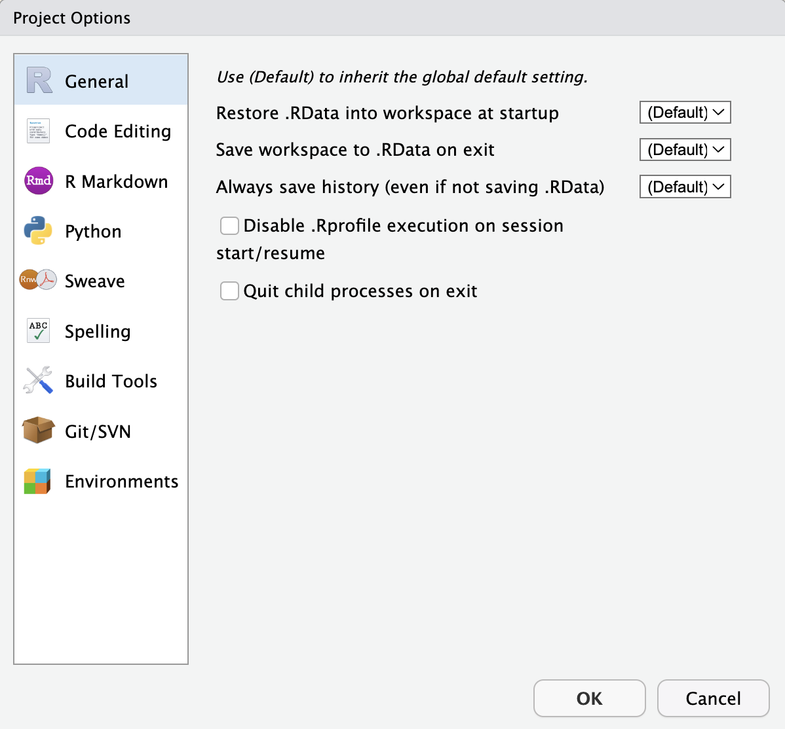
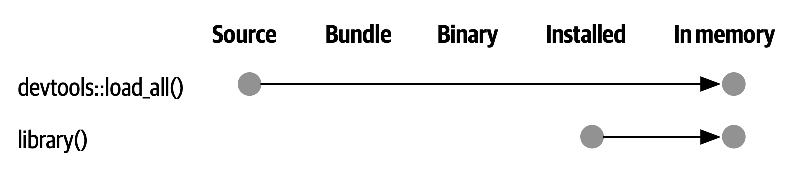

# 基本开发工作流 {#sec-workflow101}

```{r, echo = FALSE}
source("common.R")
```

在了解了 @sec-package-structure-state 中的 R 包和库的内部机制后，我们在这里提供了一个基本工作流，能够创建软件包并在开发过程出现的不同状态间进行转换。

## 创建一个软件包 {#sec-workflow101-create-package}

### 调查已经存在的软件包

许多软件包都是在人们对一些本应该更容易完成的普通任务感到沮丧而产生的。
但我们应该如何判断某些东西是否值得被制作成软件包呢？
虽然这个问题没有明确的答案，但你应该了解至少两种制作软件包的汇报：

-   结果：当这个功能在包中正式实现时，你的工作体验会变得更美好。
-   过程：更好地掌握 R 语言会让你在工作中更有效率。

如果你只关注是否能做出具体产品，那么你的主要目标就是在现有的软件包中进行检索。
Silge、Nash 和 Graves 在 useR! 2017 围绕这个问题组织了一次调查和会议，
并在他们为 R Journal 撰写的文章 [@silge-nash-graves] 中提供了一个详细的资源综述。

如果你正在寻找方法提高对 R 的掌握，那么你仍然应该对现有的软件包有所了解。
但是即使已经有相关的工作和软件包存在，仍然有很多很棒的理由制作你自己的软件包。
专家们获得成功的方式是通过亲自动手构建事物，并且通常是非常基本的事物，你也应该有同样的机会在自己动手的过程中学习。
如果你只被允许研究从未接触过的事物，你遇到的问题可能要么非常晦涩，要么非常困难。

在用户界面、默认值和边缘情况行为的基础上评估现有工具的适用性也是有用的。
一个包在技术上可以完成你所需要的任务，但对于你的用例来说，它可能非常不符合人体工程学。
在这种情况下，开发自己的功能实现或编写能够降低使用难度[^译者注：原文为 "smooth over the sharp edges"]的包装函数可能是有意义的。

如果你的工作属于一个定义良好的领域，那么即使你已经决定要创建自己的软件包，也要先了解现有的 R 包。
它们是否遵循现有的设计模式？
是否存在作为主要输入和输出的特定数据结构？
例如，围绕空间数据分析有一个非常活跃的 R 社区 ([r-spatial.org](https://www.r-spatial.org))，他们已经成功地自我组织起来，以促进不同维护者的软件包之间更大的一致性。
在建模领域，[hardhat 包](https://hardhat.tidymodels.org) 提供了用于创建与 [tidymodels](https://www.tidymodels.org) 生态兼容的建模包的框架。
如果你的包能够很好地适应相关的生态环境，那么它将得到更多的使用，并且不需要很多的文档。

### 为你的软件包取名

> "There are only two hard things in Computer Science: cache invalidation and naming things."
>
> --- Phil Karlton

在创建软件包之前，你需要为它取一个名字。
这可能是创建软件包的过程中最困难的部分！
（不仅仅是因为没人可以为你实现自动化取名。）

#### 正式的命名要求

软件包命名有三个正式的要求：

1.  名字只能由字母、数字和句点（即 `.`）组成。
2.  名字必须由字母开头。
3.  名字不能以句点（即 `.`）结尾。

不幸的是，这意味着你不能在你的包名中使用连字符或下划线，即 `-` 和 `_`。
我们建议不要在包名中使用句点 `.`，因为这会混淆句点与文件扩展名和 S3 方法的关联。

#### 需要考虑的事项

如果你打算和别人分享你的软件包，那么花几分钟想一个好名字是值得的。
以下是一些需要考虑的事项：

-   选择一个便于 Google 搜索的独特名称。
    这使得潜在的用户能够很容易地找到你的软件包（以及相关的资源），并且可以让你了解软件包的用户。

-   不要选择一个已经在 CRAN 或 Bioconductor 上使用的包名。
    你可能还需要考虑一些其他类型的命名冲突：

    -   在 GitHub 上是否有成熟的且正在开发中的软件包，该软件包已经有了一定的提交历史，并且似乎即将发布？
    -   这个名称是否已经用于另一个软件，例如是 Python 或 JavaScript 生态系统中的库或框架？

-   避免同时使用大写和小写字母：这样做会使包名称难以输入，甚至难以记住。
    例如，很难记住一个软件包的名字是 Rgtk2、RGTK2 还是 RGtk2。

-   优先选择可发音的名字，这样人们在谈论你的软件包时会很舒服，并且能够在他们的脑海里听到它。

-   找到一个能唤起对问题的联想的单词，并对其进行修改，使其具有唯一性：
    以下是一些例子：

    -   lubridate 使得处理日期和时间更加容易。
    -   rvest 从网页中“收获 (harvests)”内容。
    -   r2d3 提供了使用 D3 可视化的实用程序。
    -   forcats 是因子（factors）的变位词，即分类数据 (**for** **cat**egorical data)。

-   使用缩写，例如：

    -   Rcpp = R + C++ (plus plus)
    -   brms = 使用 Stan 的贝叶斯回归模型（Bayesian Regression Models using Stan）

-   名字后添加额外的字符 R，例如：

    -   stringr 提供字符串工具。
    -   beepr 播放通知声音。
    -   callr 在 R 中调用 R。

-   别被起诉。

    -   如果你要创建一个与商业服务有关的包，请查看商标使用指南。例如，rDrop 不被称为 rDropbox，因为 Dropbox 禁止任何应用程序使用它的完整商标名。

Nick Tierney 在他的 [Naming Things](https://www.njtierney.com/post/2018/06/20/naming-things/) 博客文章中向我们展示了一种有趣的软件包名称分类学，其中还包括更具启发性的例子。
他也有一些重命名包的经验，因此，如果你第一次取名没有做对，他的博客文章 [So, you've decided to change your r package name](https://www.njtierney.com/post/2017/10/27/change-pkg-name/) 是一个很好的资源。

#### 使用 available 包

同时遵守上述所有建议是十分困难的，因此你显然需要做出一些权衡。
[available 包](https://cran.r-project.org/package=available) 有一个名叫 `available()` 的函数，它能帮助你从多个角度评估可能的软件包名称：

```{r, eval = FALSE}
library(available)

available("doofus")
#> Urban Dictionary can contain potentially offensive results,
#>   should they be included? [Y]es / [N]o:
#> 1: 1
#> ── doofus ──────────────────────────────────────────────────────────────────
#> Name valid: ✔
#> Available on CRAN: ✔ 
#> Available on Bioconductor: ✔
#> Available on GitHub:  ✔ 
#> Abbreviations: http://www.abbreviations.com/doofus
#> Wikipedia: https://en.wikipedia.org/wiki/doofus
#> Wiktionary: https://en.wiktionary.org/wiki/doofus
#> Sentiment:???
```

`available::available()` 执行以下操作：

-   检查名称有效性。
-   检查名称是否可以在 CRAN、Bioconductor 和其他产品上使用。
-   搜索各种网站，帮助你发现任何意料之外的含义。在交互式会话中，上面的 URLs 将在浏览器选项卡中打开。
-   尝试报告该名称是否有积极或消极含义。

`pak::pkg_name_check()` 是一个有相似功能的替代函数。
由于 pak 包的开发比其它可用包更积极，因此它可能会成为更好的选择。

### 软件包项目的创建 {#sec-creating}

Once you've come up with a name, there are two ways to create the package.

-   Call `usethis::create_package()`.
-   In RStudio, do *File \> New Project \> New Directory \> R Package*. This ultimately calls `usethis::create_package()`, so really there's just one way.

<!-- *TODO: revisit when I tackle usethis + RStudio project templates <https://github.com/r-lib/usethis/issues/770>. In particular, contemplate whether to reinstate any screenshot-y coverage of RStudio workflows here.* -->

This produces the smallest possible *working* package, with three components:

1.  An `R/` directory, which you'll learn about in @sec-r.

2.  A basic `DESCRIPTION` file, which you'll learn about in @sec-description.

3.  A basic `NAMESPACE` file, which you'll learn about in @sec-dependencies-NAMESPACE-file.

It may also include an RStudio project file, `pkgname.Rproj`, that makes your package easy to use with RStudio, as described below.
Basic `.Rbuildignore` and `.gitignore` files are also left behind.

::: callout-warning
Don't use `package.skeleton()` to create a package.
Because this function comes with R, you might be tempted to use it, but it creates a package that immediately throws errors with `R CMD build`.
It anticipates a different development process than we use here, so repairing this broken initial state just makes unnecessary work for people who use devtools (and, especially, roxygen2).
Use `create_package()`.
:::

### 你应该在哪里执行 `create_package()`？

The main and only required argument to `create_package()` is the `path` where your new package will live:

```{r, eval = FALSE}
create_package("path/to/package/pkgname")
```

Remember that this is where your package lives in its **source** form (@sec-source-package), not in its **installed** form (@sec-installed-package).
Installed packages live in a **library** and we discussed conventional setups for libraries in @sec-library.

Where should you keep source packages?
The main principle is that this location should be distinct from where installed packages live.
In the absence of external considerations, a typical user should designate a directory inside their home directory for R (source) packages.
We discussed this with colleagues and the source of many tidyverse packages lives inside directories like `~/rrr/`, `~/documents/tidyverse/`, `~/r/packages/`, or `~/pkg/`.
Some of us use one directory for this, others divide source packages among a few directories based on their development role (contributor vs. not), GitHub organization (tidyverse vs r-lib), development stage (active vs. not), and so on.

The above probably reflects that we are primarily tool-builders.
An academic researcher might organize their files around individual publications, whereas a data scientist might organize around data products and reports.
There is no particular technical or traditional reason for one specific approach.
As long as you keep a clear distinction between source and installed packages, just pick a strategy that works within your overall system for file organization, and use it consistently.

## RStudio 项目 {#sec-workflow101-rstudio-projects}

devtools works hand-in-hand with RStudio, which we believe is the best development environment for most R users.
To be clear, you can use devtools without using RStudio and you can develop packages in RStudio without using devtools.
But there is a special, two-way relationship that makes it very rewarding to use devtools and RStudio together.

::: callout-tip
## RStudio

An RStudio **Project**, with a capital "P", is a regular directory on your computer that includes some (mostly hidden) RStudio infrastructure to facilitate your work on one or more **projects**, with a lowercase "p".
A project might be an R package, a data analysis, a Shiny app, a book, a blog, etc.
:::

### 使用 RStudio 项目的好处

From @sec-source-package, you already know that a source package lives in a directory on your computer.
We strongly recommend that each source package is also an RStudio Project.
Here are some of the payoffs:

-   Projects are very "launch-able".
    It's easy to fire up a fresh instance of RStudio in a Project, with the file browser and working directory set exactly the way you need, ready for work.

-   Each Project is isolated; code run in one Project does not affect any other Project.

    -   You can have several RStudio Projects open at once and code executed in Project A does not have any effect on the R session and workspace of Project B.

-   You get handy code navigation tools like `F2` to jump to a function definition and `Ctrl + .` to look up functions or files by name.

-   You get useful keyboard shortcuts and a clickable interface for common package development tasks, like generating documentation, running tests, or checking the entire package.

    ```{r}
    #| echo: false
    #| label: fig-keyboard-shortcuts
    #| out-width: ~
    #| fig-cap: >
    #|   Keyboard Shortcut Quick Reference in RStudio.
    #| fig-alt: |
    #|   Screenshot of an RStudio window with a semi-transparent
    #|   black box displaying keyboard shortcuts that overlays a
    #|   majority of the window.
    knitr::include_graphics("images/keyboard-shortcuts.png")
    ```

::: callout-tip
## RStudio

To see the most useful keyboard shortcuts, press Alt + Shift + K or use *Help \> Keyboard Shortcuts Help*.
You should see something like @fig-keyboard-shortcuts.

RStudio also provides the [*Command Palette*](https://docs.posit.co/ide/user/ide/reference/shortcuts.html#command-palette) which gives fast, searchable access to all of the IDE's commands -- especially helpful when you can't remember a particular keyboard shortcut.
It is invoked via Ctrl + Shift + P (Windows & Linux) or Cmd + Shift + P (macOS).
:::

::: callout-tip
## RStudio

Follow \@[rstudiotips](https://twitter.com/rstudiotips) on Twitter for a regular dose of RStudio tips and tricks.
:::

### 怎样开始一个 RStudio 项目

If you follow our recommendation to create new packages with `create_package()`, each new package will also be an RStudio Project, if you're working from RStudio.

If you need to designate the directory of a pre-existing source package as an RStudio Project, choose one of these options:

-   In RStudio, do *File \> New Project \> Existing Directory*.
-   Call `create_package()` with the path to the pre-existing R source package.
-   Call `usethis::use_rstudio()`, with the [active usethis project](#sec-rstudio-project-vs-active-usethis-project) set to an existing R package. In practice, this probably means you just need to make sure your working directory is inside the pre-existing package directory.

### RStudio 项目文件是什么？

A directory that is an RStudio Project will contain an `.Rproj` file.
Typically, if the directory is named "foo", the Project file is `foo.Rproj`.
And if that directory is also an R package, then the package name is usually also "foo".
The path of least resistance is to make all of these names coincide and to NOT nest your package inside a subdirectory inside the Project.
If you settle on a different workflow, just know it may feel like you are fighting with the tools.

An `.Rproj` file is just a text file.
Here is a representative project file you might see in a Project initiated via usethis:

```         
Version: 1.0

RestoreWorkspace: No
SaveWorkspace: No
AlwaysSaveHistory: Default

EnableCodeIndexing: Yes
Encoding: UTF-8

AutoAppendNewline: Yes
StripTrailingWhitespace: Yes
LineEndingConversion: Posix

BuildType: Package
PackageUseDevtools: Yes
PackageInstallArgs: --no-multiarch --with-keep.source
PackageRoxygenize: rd,collate,namespace
```

You don't need to modify this file by hand.
Instead, use the interface available via *Tools \> Project Options* (@fig-project-options) or *Project Options* in the Projects menu in the top-right corner (@fig-projects-menu).

```{r}
#| echo: false
#| label: fig-project-options
#| out-width: ~
#| fig-cap: >
#|   Project Options in RStudio.
#| fig-alt: >
#|   The Project Options preference page in the RStudio IDE. 
#|   On the left side are nine categories: General, Code Editing, R Markdown,
#|   Python, Sweave, Spelling, Build Tools, Git/SVN, and Environments.
#|   The General category is selected. In the main part of the window are 
#|   three options with dropdown boxes: 
#|   1. Restore .RData into workspace at startup; 
#|   2. Save workspace to .RData on exit; and 
#|   3. Always save history (even if not saving .RData). 
#|   All three of these options are set to "(Default)". 
#|   There are two options with checkboxes:
#|   1. Disable .Rprofile execution on session start/resume
#|   2. Quit child processes on exit
#|   Both of these are unchecked.
#|   At the top of the window is the statement: 
#|   "Use (Default) to inherit the global default setting".

```

```{r}
#| echo: false
#| label: fig-projects-menu
#| out-width: 35%
#| fig-cap: >
#|   Projects Menu in RStudio.
#| fig-alt: > 
#|   Image of the RStudio IDE Projects drop-down menu, with items: 
#|   "New Project...", "Open Project...", "Open Project in New Session...",
#|    "Close Project", then a list of projects the user has had open 
#|    recently, "Close Project", and "Project Options...". 
#|    The "Project Options..." item is selected.
knitr::include_graphics("images/project-options-1.png")
```

### 怎样启动一个 RStudio 项目

Double-click the `foo.Rproj` file in macOS's Finder or Windows Explorer to launch the foo Project in RStudio.

You can also launch Projects from within RStudio via *File \> Open Project (in New Session)* or the Projects menu in the top-right corner.

If you use a productivity or launcher app, you can probably configure it to do something delightful for `.Rproj` files.
We both use Alfred for this [^workflow101-1], which is macOS only, but similar tools exist for Windows.
In fact, this is a very good reason to use a productivity app in the first place.

[^workflow101-1]: Specifically, we configure Alfred to favor `.Rproj` files in its search results when proposing apps or files to open.
    To register the `.Rproj` file type with Alfred, go to *Preferences \> Features \> Default Results \> Advanced*.
    Drag any `.Rproj` file onto this space and then close.

It is very normal -- and productive!
-- to have multiple Projects open at once.

### RStudio Project vs. active usethis project {#sec-rstudio-project-vs-active-usethis-project}

You will notice that most usethis functions don't take a path: they operate on the files in the "active usethis project".
The usethis package assumes that 95% of the time all of these coincide:

-   The current RStudio Project, if using RStudio.
-   The active usethis project.
-   Current working directory for the R process.

If things seem funky, call `proj_sitrep()` to get a "situation report".
This will identify peculiar situations and propose ways to get back to a happier state.

```{r eval = FALSE}
# these should usually be the same (or unset)
proj_sitrep()
#> *   working_directory: '/Users/jenny/rrr/readxl'
#> * active_usethis_proj: '/Users/jenny/rrr/readxl'
#> * active_rstudio_proj: '/Users/jenny/rrr/readxl'
```

## 工作目录和文件路径规范

As you develop your package, you will be executing R code.
This will be a mix of workflow calls (e.g., `document()` or `test()`) and *ad hoc* calls that help you write your functions, examples, and tests.
We *strongly recommend* that you keep the top-level of your source package as the working directory of your R process.
This will generally happen by default, so this is really a recommendation to avoid development workflows that require you to fiddle with working directory.

If you're totally new to package development, you don't have much basis for supporting or resisting this proposal.
But those with some experience may find this recommendation somewhat upsetting.
You may be wondering how you are supposed to express paths when working in subdirectories, such as `tests/`.
As it becomes relevant, we'll show you how to exploit path-building helpers, such as `testthat::test_path()`, that determine paths at execution time.

The basic idea is that by leaving working directory alone, you are encouraged to write paths that convey intent explicitly ("read `foo.csv` from the test directory") instead of implicitly ("read `foo.csv` from current working directory, which I *think* is going to be the test directory").
A sure sign of reliance on implicit paths is incessant fiddling with your working directory, because you're using `setwd()` to manually fulfill the assumptions that are implicit in your paths.

Using explicit paths can design away a whole class of path headaches and makes day-to-day development more pleasant as well.
There are two reasons why implicit paths are hard to get right:

-   Recall the different forms that a package can take during the development cycle (@sec-package-structure-state). These states differ from each other in terms of which files and folders exist and their relative positions within the hierarchy. It's tricky to write relative paths that work across all package states.
-   Eventually, your package will be processed with built-in tools like `R CMD build`, `R CMD check`, and `R CMD INSTALL`, by you and potentially CRAN. It's hard to keep track of what the working directory will be at every stage of these processes.

Path helpers like `testthat::test_path()`, `fs::path_package()`, and the [rprojroot package](https://rprojroot.r-lib.org) are extremely useful for building resilient paths that hold up across the whole range of situations that come up during development and usage.
Another way to eliminate brittle paths is to be rigorous in your use of proper methods for storing data inside your package (@sec-data) and to target the session temp directory when appropriate, such as for ephemeral testing artefacts (@sec-testing-basics).

## 使用 `load_all()` 驱动测试 {#sec-workflow101-load-all}

The `load_all()` function is arguably the most important part of the devtools workflow.

```{r, eval = FALSE}
# with devtools attached and
# working directory set to top-level of your source package ...

load_all()

# ... now experiment with the functions in your package
```

`load_all()` is the key step in this "lather, rinse, repeat" cycle of package development:

1.  Tweak a function definition.
2.  `load_all()`
3.  Try out the change by running a small example or some tests.

When you're new to package development or to devtools, it's easy to overlook the importance of `load_all()` and fall into some awkward habits from a data analysis workflow.

### 使用 `load_all()` 的好处

When you first start to use a development environment, like RStudio or VS Code, the biggest win is the ability to send lines of code from an `.R` script for execution in R console.
The fluidity of this is what makes it tolerable to follow the best practice of regarding your source code as real [^workflow101-2] (as opposed to objects in the workspace) and saving `.R` files (as opposed to saving and reloading `.Rdata`).

[^workflow101-2]: Quoting the usage philosophy favored by [Emacs Speaks Statistics](https://ess.r-project.org/Manual/ess.html#Philosophies-for-using-ESS_0028R_0029) (ESS).

`load_all()` has the same significance for package development and, ironically, requires that you NOT test drive package code in the same way as script code.
`load_all()` *simulates* the full blown process for seeing the effect of a source code change, which is clunky enough [^workflow101-3] that you won't want to do it very often.
@fig-load-all reinforces that the `library()` function can only load a package that has been installed, whereas `load_all()` gives a high-fidelity simulation of this, based on the current package source.

[^workflow101-3]: The command line approach is to quit R, go to the shell, do `R CMD build foo` in the package's parent directory, then `R CMD INSTALL foo_x.y.x.tar.gz`, restart R, and call `library(foo`).

```{r}
#| echo: false
#| label: fig-load-all
#| out-width: ~
#| fig-cap: >
#|   devtools::load_all() vs. library().
#| fig-alt: > 
#|   Diagram listing five package states: source, bundle, binary, installed,
#|   in memory.
#|   Two functions for converting a package from one state to another are
#|   depicted.
#|   First, `devtools::load_all()` is shown to convert a source package to one
#|   that is in memory.
#|   Second, `library()` is shown to put an installed package in memory.

```

The main benefits of `load_all()` include:

-   You can iterate quickly, which encourages exploration and incremental progress.
    -   This iterative speedup is especially noticeable for packages with compiled code.
-   You get to develop interactively under a namespace regime that accurately mimics how things are when someone uses your installed package, with the following additional advantages:
    -   You can call your own internal functions directly, without using `:::` and without being tempted to temporarily define your functions in the global workspace.
    -   You can also call functions from other packages that you've imported into your `NAMESPACE`, without being tempted to attach these dependencies via `library()`.

`load_all()` removes friction from the development workflow and eliminates the temptation to use workarounds that often lead to mistakes around namespace and dependency management.

### 调用 `load_all()` 的其它方法

When working in a Project that is a package, RStudio offers several ways to call `load_all()`:

-   Keyboard shortcut: Cmd+Shift+L (macOS), Ctrl+Shift+L (Windows, Linux)
-   Build pane's *More ...* menu
-   *Build \> Load All*

`devtools::load_all()` is a thin wrapper around `pkgload::load_all()` that adds a bit of user-friendliness.
It is unlikely you will use `load_all()` programmatically or inside another package, but if you do, you should probably use `pkgload::load_all()` directly.

## `check()` 以及 `R CMD check` {#sec-workflow101-r-cmd-check}

Base R provides various command line tools and `R CMD check` is the official method for checking that an R package is valid.
It is essential to pass `R CMD check` if you plan to submit your package to CRAN, but we **highly recommend** holding yourself to this standard even if you don't intend to release your package on CRAN.
`R CMD check` detects many common problems that you'd otherwise discover the hard way.

Our recommended way to run `R CMD check` is in the R console via devtools:

```{r}
#| eval: false
devtools::check()
```

We recommend this because it allows you to run `R CMD check` from within R, which dramatically reduces friction and increases the likelihood that you will `check()` early and often!
This emphasis on fluidity and fast feedback is exactly the same motivation as given for `load_all()`.
In the case of `check()`, it really is executing `R CMD check` for you.
It's not just a high fidelity simulation, which is the case for `load_all()`.

::: callout-tip
## RStudio

RStudio exposes `check()` in the *Build* menu, in the *Build* pane via *Check*, and in keyboard shortcuts Ctrl + Shift + E (Windows & Linux) or Cmd + Shift + E (macOS).
:::

A rookie mistake that we see often in new package developers is to do too much work on their package before running `R CMD check`.
Then, when they do finally run it, it's typical to discover many problems, which can be very demoralizing.
It's counter-intuitive but the key to minimizing this pain is to run `R CMD check` more often: the sooner you find a problem, the easier it is to fix[^workflow101-4].
We model this behaviour very intentionally in @sec-whole-game.

[^workflow101-4]: A great blog post advocating for "if it hurts, do it more often" is [FrequencyReducesDifficulty](https://martinfowler.com/bliki/FrequencyReducesDifficulty.html) by Martin Fowler.

The upper limit of this approach is to run `R CMD check` every time you make a change.
We don't run `check()` manually quite that often, but when we're actively working on a package, it's typical to `check()` multiple times per day.
Don't tinker with your package for days, weeks, or months, waiting for some special milestone to finally run `R CMD check`.
If you use GitHub (@sec-sw-dev-practices-git-github), we'll show you how to set things up so that `R CMD check` runs automatically every time you push (@sec-sw-dev-practices-gha).

### 工作流 {#check-workflow}

Here's what happens inside `devtools::check()`:

-   Ensures that the documentation is up-to-date by running `devtools::document()`.

-   Bundles the package before checking it (@sec-bundled-package).
    This is the best practice for checking packages because it makes sure the check starts with a clean slate: because a package bundle doesn't contain any of the temporary files that can accumulate in your source package, e.g. artifacts like `.so` and `.o` files which accompany compiled code, you can avoid the spurious warnings such files will generate.

-   Sets the `NOT_CRAN` environment variable to `"true"`.
    This allows you to selectively skip tests on CRAN.
    See `?testthat::skip_on_cran` and @sec-testing-advanced-skip-on-cran for details.

The workflow for checking a package is simple, but tedious:

1.  Run `devtools::check()`, or press Ctrl/Cmd + Shift + E.

2.  Fix the first problem.

3.  Repeat until there are no more problems.

`R CMD check` returns three types of messages:

-   `ERROR`s: Severe problems that you should fix regardless of whether or not you're submitting to CRAN.

-   `WARNING`s: Likely problems that you must fix if you're planning to submit to CRAN (and a good idea to look into even if you're not).

-   `NOTE`s: Mild problems or, in a few cases, just an observation.
    If you are submitting to CRAN, you should strive to eliminate all NOTEs, even if they are false positives.
    If you have no NOTEs, human intervention is not required, and the package submission process will be easier.
    If it's not possible to eliminate a `NOTE`, you'll need describe why it's OK in your submission comments, as described in @sec-release-process.
    If you're not submitting to CRAN, carefully read each NOTE.
    If it's easy to eliminate the NOTEs, it's worth it, so that you can continue to strive for a totally clean result.
    But if eliminating a NOTE will have a net negative impact on your package, it is reasonable to just tolerate it.
    Make sure that doesn't lead to you ignoring other issues that really should be addressed.

`R CMD check` consists of dozens of individual checks and it would be overwhelming to enumerate them here.
See our [online-only guide to `R CMD check`](https://r-pkgs.org/R-CMD-check.html) for details.

### `R CMD check` 的幕后工作

As you accumulate package development experience, you might want to access `R CMD check` directly at some point.
Remember that `R CMD check` is something you must run in the terminal, not in the R console.
You can see its documentation like so:

``` bash
R CMD check --help
```

`R CMD check` can be run on a directory that holds an R package in source form (@sec-source-package) or, preferably, on a package bundle (@sec-bundled-package):

``` bash
R CMD build somepackage
R CMD check somepackage_0.0.0.9000.tar.gz  
```

To learn more, see the [Checking packages](https://cran.r-project.org/doc/manuals/R-exts.html#Checking-packages) section of [Writing R Extensions](https://cran.r-project.org/doc/manuals/R-exts.html).
